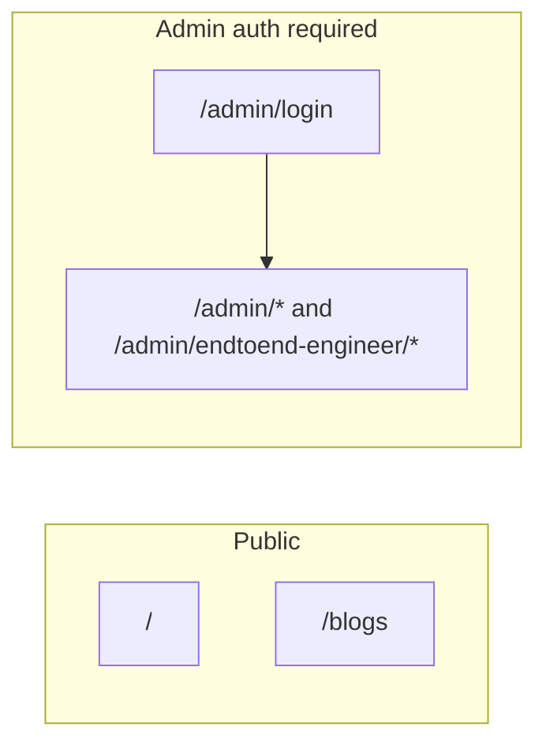

# Routes reference

Complete list of URLs for the Design Bakery app. All paths are client-side routes (SPA); [`vercel.json`](../vercel.json) rewrites unknown paths to `index.html`.

Defined in [`src/app/App.tsx`](../src/app/App.tsx) and [`src/app/modules/admin/adminRoutes.tsx`](../src/app/modules/admin/adminRoutes.tsx).

---

## Quick map

---

## Public routes

### Public site

Base path: **none** (`portfolioId: endtoend-engineer`). Includes top [`Navigation`](../src/app/components/Navigation.tsx).

| URL | Component | Description |
|-----|-----------|-------------|
| `/` | `EngineeringHome` | End-to-end engineering homepage (hero, projects, community, about, skills, insights, experience, contact, footer) |
| `/blogs` | `BlogListPage` | Shared blog index |
| `/blogs/:blogId` | `BlogDetailPage` | Shared blog detail page |

Legacy public portfolio URLs redirect to `/` and are documented in [`routes-archive.md`](./routes-archive.md).

### Auth

| URL | Component | Description |
|-----|-----------|-------------|
| `/admin/login` | `AdminLogin` | Firebase email/password login; redirects to `/admin` on success |

---

## In-page section anchors

Hash links (`#section-id`) scroll within the current engineering home. Navbar **Projects**, **About**, and **Contact** use these on `/`.

### Engineering home

| Anchor | Section |
|--------|---------|
| `#projects` | Engineering projects |
| `#about` | About me |
| `#skills` | Skills and technologies |
| `#insights` | Engineering insights (blog teasers) |
| `#contact` | Let's connect |

`RelevantExperience` is rendered on the page but has no `id` on its `<section>` today, so it is not reachable via navbar hash links.

## Admin routes

Requires Firebase auth (except `/admin/login`). Unauthenticated users are redirected to login.

Single profile (`endtoend-engineer`) since TASK-DB-0049 — no portfolio switcher. `/admin/*` and `/admin/endtoend-engineer/*` mount the same editors; sidebar links use the `/admin/endtoend-engineer` base.

| Path (relative to admin base) | Editor |
|-----|--------|
| *(index)*, `blog` | `BlogEditor` |
| `blog-categories` | `BlogCategoriesEditor` |
| `projects` | `ProjectsEditor` |
| `hero` | `EngineeringHeroEditor` |
| `community` | `EngineeringCommunityEditor` |
| `about-content` | `EngineeringAboutEditor` |
| `engineering-skills-meta` | `EngineeringSkillsMetaEditor` |
| `contact-section` | `ContactSectionEditor` |
| `footer` | `FooterEditor` |
| `relevant-experience` | `RelevantExperienceEditor` |
| `engineering-skills` | `EngineeringSkillsEditor` |
| `media-library` | `MediaLibraryEditor` |
| `cover-studio`, `cover-studio/pack/:packId` | `CoverStudioEditor`, `CoverStudioPackEditor` |
| `contact` | `ContactEditor` (social links) |

The design-portfolio editors (`AboutEditor`, `SkillsEditor`, `AdvocacyEditor`, `ArtGalleryEditor`, `WebShowcaseEditor`, `GalleryPageEditor`) are no longer routed.

Blog editors edit the **same** shared `blog_posts` / `blog_categories` data.

---

## Public navbar vs routes

Shown on the homepage only (`PortfolioPublicLayout`):

| Nav control | Target |
|-------------|--------|
| Logo / brand | `/` |
| Projects | `#projects` |
| About | `#about` |
| Contact | `#contact` |

The public site only exposes `/` and `/blogs`.

**Not in public nav:** Legacy portfolios, design, admin, portfolio switcher.

---

## Routes not registered in `App.tsx`

These files exist but are **not** mounted on a path:

| File | Notes |
|------|--------|
| [`src/app/components/BlogPage.tsx`](../src/app/components/BlogPage.tsx) | Legacy/alternate blog UI; superseded by `BlogListPage` |
| [`src/app/components/BlogPostPage.tsx`](../src/app/components/BlogPostPage.tsx) | Unused standalone post layout |

---

## Adding a new portfolio (route checklist)

1. Public: add `/your-slug` plus any blog routes you need under `PortfolioPublicLayout` in `App.tsx`.
2. Register `your-slug` in [`registry.ts`](../src/app/portfolios/registry.ts).
3. Admin: add `<Route path="/admin/your-slug" element={<AdminLayoutShell />}>` with `buildAdminChildRoutes('your-slug')`.
4. Update `getPortfolioFromPathname` and `getPortfolioIdFromAdminPath`.
5. Document new URLs in this file.

---

## Related docs

- [project-guide.md](./project-guide.md) — architecture and data loading
- [README.md](./README.md) — quick start
