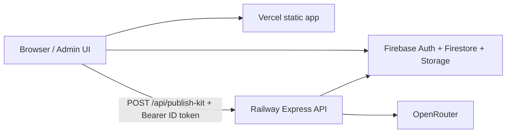

# Deploy: same repo, Vercel (frontend) + Railway (backend)

One GitHub repo, two hosts:

| Host | Deploys | URL example |
|------|---------|-------------|
| **Vercel** | Vite/React (`pnpm run build` → `dist/`) | `https://www.design-bakery.com` |
| **Railway** | Express API (`backend/` + compiled `functions/`) | `https://design-bakery-api.up.railway.app` |

Firebase (Auth, Firestore, Storage) stays on the **Spark** plan. You do **not** need Firebase Cloud Functions or Blaze billing for blog AI if Railway is configured.

---

## Prerequisites

- GitHub repo connected to both Vercel and Railway
- Firebase project (`auth-system-be464` or yours) with admin users
- [OpenRouter](https://openrouter.ai/) API key
- Firebase **service account** JSON (Admin SDK) for Storage uploads from the API

---

## 1. Railway — backend (`backend/`)

### Create the service

1. [Railway](https://railway.app) → **New Project** → **Deploy from GitHub repo** → select `design-bakery`.
2. Open the new service → **Settings**:
   - **Root Directory:** either:
     - **Empty** (repo root) — **Config file:** `railway.toml` (recommended), or
     - **`backend`** — **Config file:** `railway.toml` (uses `backend/railway.toml` in this repo)
   - **Watch Paths** (optional): `backend/**`, `pnpm-lock.yaml`, `railway.toml`
3. **Build / Start** — set automatically from the chosen `railway.toml`, or manually:
   - **Build command:**
     ```bash
     corepack enable pnpm && pnpm install --frozen-lockfile && pnpm --dir backend/services run build && pnpm --dir backend run build
     ```
   - **Start command:** `node backend/lib/server.js` (repo root) or `node lib/server.js` (root = `backend`)
   - Node **20+** (`.node-version` + `nixpacks.toml` at repo root)
4. **Networking** → **Generate Domain** (or attach a custom domain). Copy the HTTPS URL, e.g. `https://design-bakery-api-production.up.railway.app` (no trailing slash).

### Environment variables (Railway)

Set these in the service **Variables** tab (not in git):

| Variable | Required | Example / notes |
|----------|----------|-----------------|
| `OPENROUTER_API_KEY` | Yes | `sk-or-...` — same key you use locally |
| `FIREBASE_STORAGE_BUCKET` | Yes | `auth-system-be464.firebasestorage.app` |
| `GOOGLE_APPLICATION_CREDENTIALS_JSON` | Yes | Entire service account JSON **on one line** (see below) |
| `ALLOWED_ORIGINS` | Yes | `https://www.design-bakery.com,https://design-bakery.com` |
| `OPENROUTER_MODEL` | No | `deepseek/deepseek-chat-v3.1` |
| `OPENROUTER_IMAGE_MODEL` | No | `google/gemini-2.5-flash-image` |
| `PUBLISH_KIT_VISUAL_MODE` | No | `hybrid` |
| `ALLOWED_ADMIN_EMAILS` | No | Comma-separated admin emails; empty = any signed-in user |

**Service account JSON (one line):**

1. Firebase Console → Project settings → **Service accounts** → **Generate new private key**.
2. Minify to one line (no newlines inside the variable):
   ```bash
   # macOS — copies minified JSON to clipboard
   jq -c . ~/Downloads/your-project-firebase-adminsdk.json | pbcopy
   ```
3. Paste into Railway as `GOOGLE_APPLICATION_CREDENTIALS_JSON`.

Do **not** put `OPENROUTER_API_KEY` or the service account JSON on Vercel — set them only on **Railway** (see `backend/.env.example`).

### Verify Railway

```bash
curl -s https://YOUR-RAILWAY-URL.up.railway.app/health
# {"ok":true,"service":"design-bakery-api"}
```

Deploy logs should show: `[api] design-bakery-api http://0.0.0.0:...`

---

## 2. Vercel — frontend (`frontend/`)

### Create / configure the project

1. [Vercel](https://vercel.com) → **Add New Project** → import the **same** GitHub repo.
2. **Root Directory:** leave **empty** (repo root).  
   The repo root `vercel.json` runs `pnpm --dir frontend run build` and outputs `frontend/dist`.  
   (Alternatively: Root Directory = `frontend` only if you drop the root `vercel.json` and set Output = `dist` there.)
3. **Framework Preset:** Vite (or Other — root `vercel.json` overrides build/output).
4. **Build & Development Settings** (optional if using root `vercel.json`):

   | Setting | Value |
   |---------|--------|
   | Install Command | `pnpm install` |
   | Build Command | `pnpm --dir frontend run build` |
   | Output Directory | `frontend/dist` |
   | Node.js Version | 20.x or 22.x |

5. **Environment Variables** — add every `VITE_*` from `frontend/.env.example` (**Production** scope). Minimum for blog admin:

   | Variable | Production value |
   |----------|------------------|
   | `VITE_FIREBASE_API_KEY` | From Firebase web app config |
   | `VITE_FIREBASE_AUTH_DOMAIN` | `….firebaseapp.com` |
   | `VITE_FIREBASE_PROJECT_ID` | e.g. `auth-system-be464` |
   | `VITE_FIREBASE_STORAGE_BUCKET` | `….firebasestorage.app` |
   | `VITE_FIREBASE_APP_ID` | Web app ID |
   | `VITE_ENABLE_BLOG_AGENTS` | `true` (or leave unset — prod defaults on) |
   | `VITE_ENABLE_BLOG_PUBLISH_KIT` | `true` (or leave unset) |
   | **`VITE_BLOG_API_URL`** | **`https://YOUR-RAILWAY-URL.up.railway.app`** (no trailing slash) |

   **Do not set on Vercel (production):**

   - `VITE_USE_FUNCTIONS_EMULATOR`
   - `OPENROUTER_API_KEY` (no `VITE_` prefix — belongs on Railway only)
   - `GOOGLE_APPLICATION_CREDENTIALS_JSON`

6. **Deploy**. After the first deploy, open the production URL → sign in to admin → test **Publish kit** / **Blog agents**.

### Publish kit images (Save post)

Preview images in the editor are temporary `data:` URLs. **Save post** uploads them server-side and stores public **`https://storage.googleapis.com/...`** (or Firebase download) links in Firestore — the browser does **not** upload to Storage in production (avoids bucket CORS).

**Required for Save with generated images:**

- `VITE_BLOG_API_URL` → Railway URL (above)
- Railway: `GOOGLE_APPLICATION_CREDENTIALS_JSON` + `FIREBASE_STORAGE_BUCKET`

If Save still hits `firebasestorage.googleapis.com` from the browser, the production build is missing `VITE_BLOG_API_URL` — redeploy Vercel after adding it.

**Optional (localhost browser upload only):** `pnpm run storage:cors` applies `firebase/storage.cors.json` to the bucket.

### Custom domain (optional)

Vercel → Project → **Domains** → add `www.design-bakery.com` and `design-bakery.com`.  
Update Railway `ALLOWED_ORIGINS` if you add new origins.

---

## 3. Wire frontend → backend



1. Deploy **Railway** first and confirm `/health`.
2. Set **`VITE_BLOG_API_URL`** on Vercel to the Railway URL.
3. **Redeploy** Vercel (env vars are baked in at build time for `VITE_*`).

The app uses `src/app/lib/blogCallables.ts`: when `VITE_BLOG_API_URL` is set, admin AI calls go to Railway; otherwise it tries Firebase callables.

---

## 4. Local development (same split)

**`frontend/.env`** (see `frontend/.env.example`):

```env
VITE_BLOG_API_URL=http://localhost:8787
VITE_ENABLE_BLOG_AGENTS=true
VITE_ENABLE_BLOG_PUBLISH_KIT=true
# …VITE_FIREBASE_* …
```

**`backend/.env`** (see `backend/.env.example`):

```env
OPENROUTER_API_KEY=sk-or-...
FIREBASE_STORAGE_BUCKET=auth-system-be464.firebasestorage.app
```

```bash
cp frontend/.env.example frontend/.env
cp backend/.env.example backend/.env
pnpm run dev:stack    # Vite + Express on :8787
```

With `VITE_BLOG_API_URL` set, `pnpm run dev` skips the Functions emulator.  
Full reference: [env.md](./env.md).

---

## 5. Checklist

### Railway

- [ ] Root Directory = `backend`
- [ ] Build succeeds (`functions` + `backend` compile)
- [ ] `GET /health` returns `ok: true`
- [ ] `OPENROUTER_API_KEY` set
- [ ] `GOOGLE_APPLICATION_CREDENTIALS_JSON` set (one line)
- [ ] `ALLOWED_ORIGINS` includes your Vercel/production domains

### Vercel

- [ ] Output Directory = `frontend/dist` (or repo root + root `vercel.json`)
- [ ] `VITE_BLOG_API_URL` = Railway HTTPS URL
- [ ] All `VITE_FIREBASE_*` set for Production
- [ ] `VITE_USE_FUNCTIONS_EMULATOR` **not** set in Production
- [ ] Redeploy after changing `VITE_*`

### Smoke test (production)

- [ ] Open `/admin` (or your admin route), sign in
- [ ] Open a saved blog post → **Publish kit** → **Generate SEO text + tags** (no CORS / 404 in browser Network tab)
- [ ] **Generate images** → **Apply** → **Save** (cover URLs are `https://` Storage URLs, not `data:`)

---

## Troubleshooting

| Symptom | Likely cause | Fix |
|---------|----------------|-----|
| CORS error on `*.up.railway.app` | Origin not in `ALLOWED_ORIGINS` | Add exact browser origin (www vs non-www) |
| `401` / “Sign in to admin” | Missing or expired Firebase ID token | Sign in again on the Vercel site |
| `OPENROUTER_API_KEY is missing` | Key only on Vercel, not Railway | Move key to Railway variables |
| Publish kit works locally, not prod | `VITE_BLOG_API_URL` missing or old build | Set on Vercel → **Redeploy** |
| Still hits `cloudfunctions.net` | `VITE_BLOG_API_URL` unset | Set Railway URL on Vercel |
| Storage upload fails | Bad or missing service account JSON | Regenerate key; fix `GOOGLE_APPLICATION_CREDENTIALS_JSON` |
| Railway build: `npm ci` fails | Repo uses pnpm only | Use the `pnpm` build command in §1 |

---

## What each host must **not** deploy

| Host | Ignore / do not run |
|------|---------------------|
| **Vercel** | `backend/`, `functions/` deploy scripts, Firebase `functions deploy` |
| **Railway** | `pnpm run build` for Vite, `dist/`, Vercel rewrites |

Both can stay on the same branch (e.g. `main`); only **Root Directory** and **env vars** differ.

---

## Related docs

- API routes and local run: [`backend/README.md`](../backend/README.md)
- Publish kit behavior: [`guidelines/agent-devlog-blog-publish-kit.md`](../guidelines/agent-devlog-blog-publish-kit.md)
- Env: [env.md](./env.md), [`frontend/.env.example`](../frontend/.env.example), [`backend/.env.example`](../backend/.env.example)
