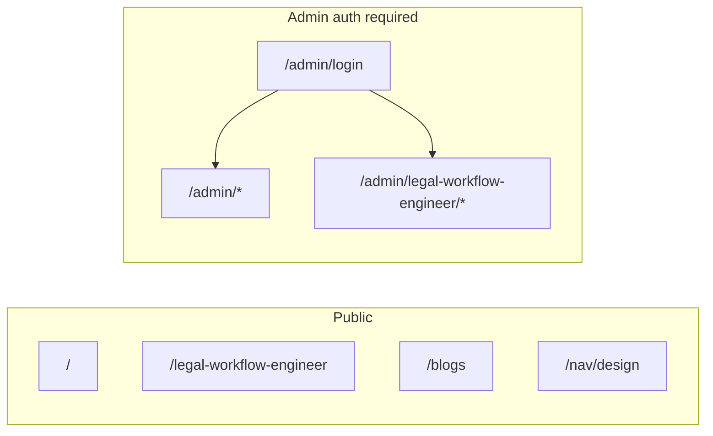

# Routes reference

Complete list of URLs for the Design Bakery app. All paths are client-side routes (SPA); [`vercel.json`](../vercel.json) rewrites unknown paths to `index.html`.

Defined in [`src/app/App.tsx`](../src/app/App.tsx) and [`src/app/modules/admin/adminRoutes.tsx`](../src/app/modules/admin/adminRoutes.tsx).

---

## Quick map

---

## Public routes

### Engineering — default portfolio

Base path: **none** (`portfolioId: default`). Includes top [`Navigation`](../src/app/components/Navigation.tsx).

| URL | Component | Description |
|-----|-----------|-------------|
| `/` | `EngineeringHome` | Main engineering portfolio (hero, projects, community, about, skills, insights, experience, contact, footer) |
| `/blogs` | `BlogListPage` | Shared blog index; category filter defaults to **All** (`all`) |
| `/blogs/:blogId` | `BlogDetailPage` | Single post (`blogId` = numeric id from blog data) |

### Engineering — legal-workflow-engineer portfolio

Base path: **`/legal-workflow-engineer`**. Same components as default; different Firestore/JSON content. Same public nav pattern (scoped links).

| URL | Component | Description |
|-----|-----------|-------------|
| `/legal-workflow-engineer` | `EngineeringHome` | LWE engineering portfolio |
| `/legal-workflow-engineer/blogs` | `BlogListPage` | Shared posts; category filter defaults to **Systems** (`systems`) |
| `/legal-workflow-engineer/blogs/:blogId` | `BlogDetailPage` | Single post (shared content) |

### Engineering — endtoend-engineer demo portfolio

Base path: **`/endtoend-engineer`**. Same layout as default/LWE; **demo JSON fallbacks** (teal/orange pipeline theme) for hero, about, projects, skills, and experience.

| Path | Component | Notes |
|------|-----------|--------|
| `/endtoend-engineer` | `EngineeringHome` | Demo E2E engineering portfolio |
| `/endtoend-engineer/blogs` | `BlogListPage` | Shared posts; category filter defaults to **Architecture** (`architecture`) |
| `/endtoend-engineer/blogs/:blogId` | `BlogDetailPage` | Single post (shared content) |

### Design portfolio

No shared engineering nav. Design page does not use `PortfolioPublicLayout`.

| URL | Component | Description |
|-----|-----------|-------------|
| `/nav/design` | `DesignPortfolio` | **Canonical** design portfolio URL (not linked from main nav) |
| `/design` | `DesignPortfolio` | Legacy alias; same page as `/nav/design` |

**Design-only UI state (not separate URLs):** Choosing a gallery from `ArtGallery` or `Advocacy` swaps the view to `GalleryPage` in React state (`currentGallery`). Browser URL stays `/nav/design` or `/design`.

### Auth

| URL | Component | Description |
|-----|-----------|-------------|
| `/admin/login` | `AdminLogin` | Firebase email/password login; redirects to `/admin` on success |

---

## In-page section anchors

Hash links (`#section-id`) scroll within the current engineering home. Navbar **Projects**, **About**, and **Contact** use these on `/` or `/legal-workflow-engineer`.

### Default and LWE engineering home

| Anchor | Section |
|--------|---------|
| `#projects` | Engineering projects |
| `#about` | About me |
| `#skills` | Skills and technologies |
| `#insights` | Engineering insights (blog teasers) |
| `#contact` | Let's connect |

`RelevantExperience` is rendered on the page but has no `id` on its `<section>` today, so it is not reachable via navbar hash links.

### Design portfolio (`/nav/design`, `/design`)

| Anchor | Section |
|--------|---------|
| `#showcase` | Web design showcase |
| `#advocacy` | Advocacy |
| `#about` | About me (includes career timeline pills) |
| `#gallery` | Art gallery |
| `#skills` | Design skills |
| `#blog` | Design blog highlights |
| `#contact` | Contact (shared component) |

---

## Admin routes

Requires Firebase auth (except `/admin/login`). Unauthenticated users are redirected to login.

**Portfolio switcher** (sidebar only): links between `/admin`, `/admin/legal-workflow-engineer`, and `/admin/endtoend-engineer`. Not shown on public pages.

### Default portfolio admin — `/admin`

Parent layout: `AdminLayoutShell` → `AdminLayout`.  
**Content scope:** default engineering Firestore collections + global design collections + shared blogs.

| URL | Editor | Content |
|-----|--------|---------|
| `/admin` | `BlogEditor` | Blog posts (index route) |
| `/admin/blog` | `BlogEditor` | Blog posts |
| `/admin/blog-categories` | `BlogCategoriesEditor` | Blog categories (shared) |
| `/admin/projects` | `ProjectsEditor` | Engineering projects |
| `/admin/hero` | `EngineeringHeroEditor` | Hero banner |
| `/admin/community` | `EngineeringCommunityEditor` | Community and advisory |
| `/admin/about-content` | `EngineeringAboutEditor` | About me copy |
| `/admin/engineering-skills-meta` | `EngineeringSkillsMetaEditor` | Skills section heading |
| `/admin/contact-section` | `ContactSectionEditor` | Let's connect copy |
| `/admin/footer` | `FooterEditor` | Footer |
| `/admin/relevant-experience` | `RelevantExperienceEditor` | Relevant experience |
| `/admin/engineering-skills` | `EngineeringSkillsEditor` | Skill categories |
| `/admin/about` | `AboutEditor` | Design about timeline |
| `/admin/skills` | `SkillsEditor` | Design skills |
| `/admin/advocacy` | `AdvocacyEditor` | Advocacy images |
| `/admin/art-gallery` | `ArtGalleryEditor` | Art gallery |
| `/admin/web-showcase` | `WebShowcaseEditor` | Web showcase projects |
| `/admin/ai-showcase` | `WebShowcaseEditor` | AI showcase projects (same editor) |
| `/admin/gallery` | `GalleryPageEditor` | Gallery page items |
| `/admin/contact` | `ContactEditor` | Social links (default portfolio) |

### Legal-workflow-engineer admin — `/admin/legal-workflow-engineer`

Same engineering editors as above; **no design editors**. Uses `lwe__*` Firestore collections for engineering fields.

| URL | Editor |
|-----|--------|
| `/admin/legal-workflow-engineer` | `BlogEditor` (index) |
| `/admin/legal-workflow-engineer/blog` | `BlogEditor` |
| `/admin/legal-workflow-engineer/blog-categories` | `BlogCategoriesEditor` |
| `/admin/legal-workflow-engineer/projects` | `ProjectsEditor` |
| `/admin/legal-workflow-engineer/hero` | `EngineeringHeroEditor` |
| `/admin/legal-workflow-engineer/community` | `EngineeringCommunityEditor` |
| `/admin/legal-workflow-engineer/about-content` | `EngineeringAboutEditor` |
| `/admin/legal-workflow-engineer/engineering-skills-meta` | `EngineeringSkillsMetaEditor` |
| `/admin/legal-workflow-engineer/contact-section` | `ContactSectionEditor` |
| `/admin/legal-workflow-engineer/footer` | `FooterEditor` |
| `/admin/legal-workflow-engineer/relevant-experience` | `RelevantExperienceEditor` |
| `/admin/legal-workflow-engineer/engineering-skills` | `EngineeringSkillsEditor` |
| `/admin/legal-workflow-engineer/contact` | `ContactEditor` (LWE social links) |

Blog editors on both admins edit the **same** shared `blog_posts` / `blog_categories` data.

---

## Public navbar vs routes

Shown on engineering pages only (`PortfolioPublicLayout`):

| Nav control | Default portfolio target | LWE target |
|-------------|-------------------------|------------|
| Logo / brand | `/` | `/legal-workflow-engineer` |
| Blogs | `/blogs` | `/legal-workflow-engineer/blogs` |
| Projects | `#projects` on home | `#projects` on LWE home |
| About | `#about` | `#about` |
| Contact | `#contact` | `#contact` |

**Not in public nav:** Design (`/nav/design`), admin, portfolio switcher.

---

## Routes not registered in `App.tsx`

These files exist but are **not** mounted on a path:

| File | Notes |
|------|--------|
| [`src/app/components/BlogPage.tsx`](../src/app/components/BlogPage.tsx) | Legacy/alternate blog UI; superseded by `BlogListPage` |
| [`src/app/components/BlogPostPage.tsx`](../src/app/components/BlogPostPage.tsx) | Unused standalone post layout |

---

## Adding a new portfolio (route checklist)

1. Public: add `/your-slug`, `/your-slug/blogs`, `/your-slug/blogs/:blogId` under `PortfolioPublicLayout` in `App.tsx`.
2. Register `your-slug` in [`registry.ts`](../src/app/portfolios/registry.ts).
3. Admin: add `<Route path="/admin/your-slug" element={<AdminLayoutShell />}>` with `buildAdminChildRoutes('your-slug')`.
4. Update `getPortfolioFromPathname` and `getPortfolioIdFromAdminPath`.
5. Document new URLs in this file.

---

## Related docs

- [project-guide.md](./project-guide.md) — architecture and data loading
- [README.md](./README.md) — quick start
