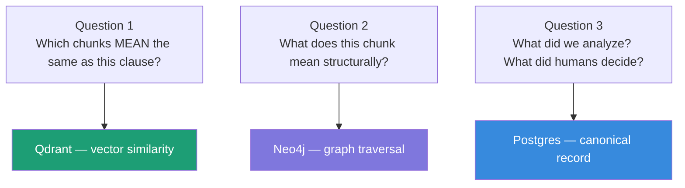
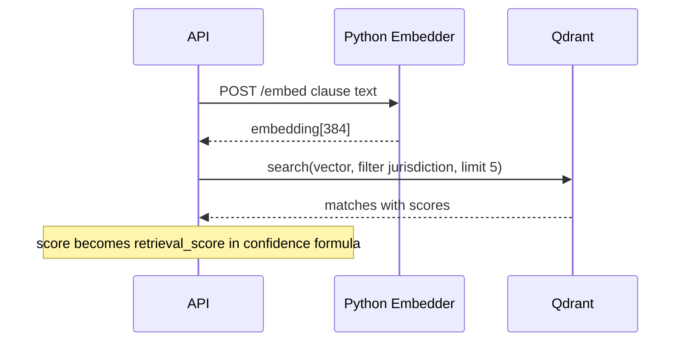
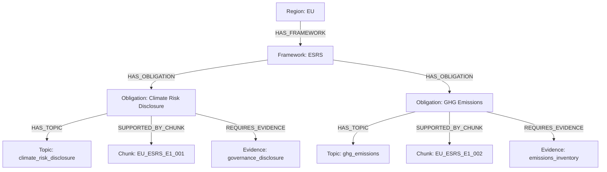
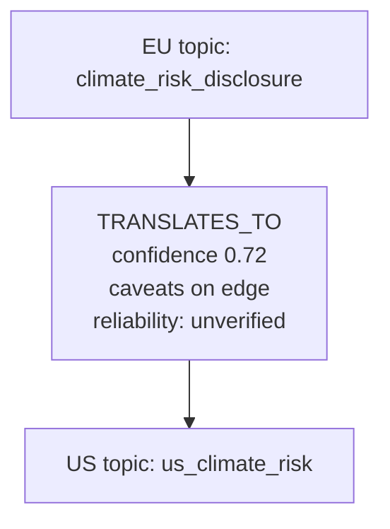
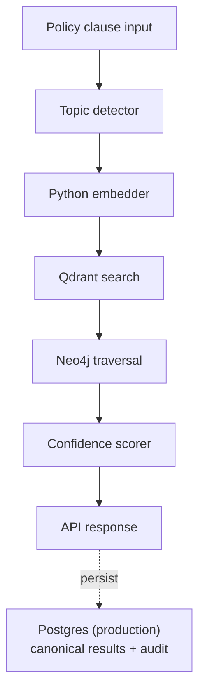
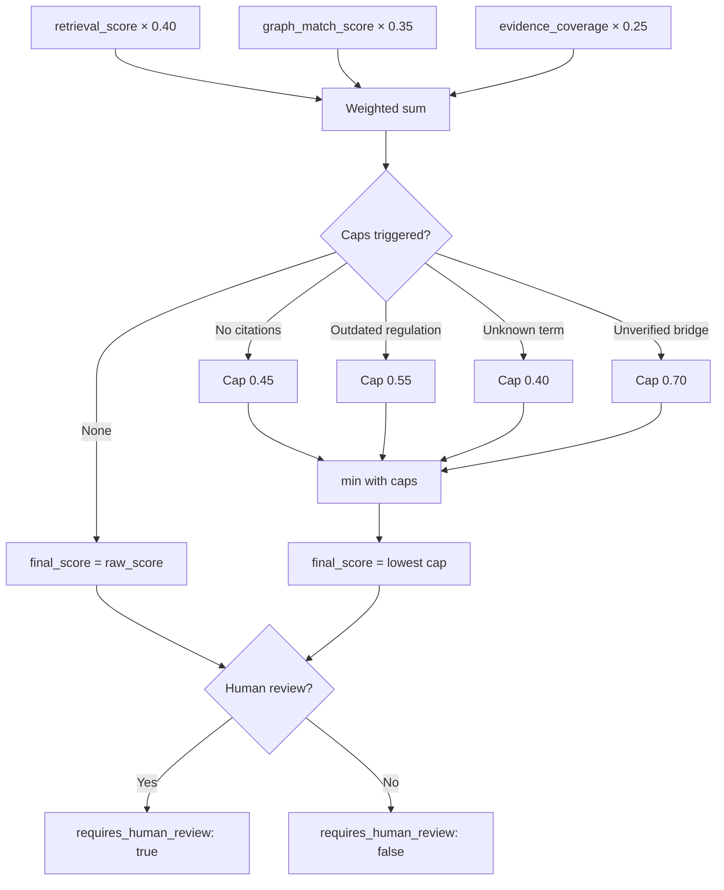
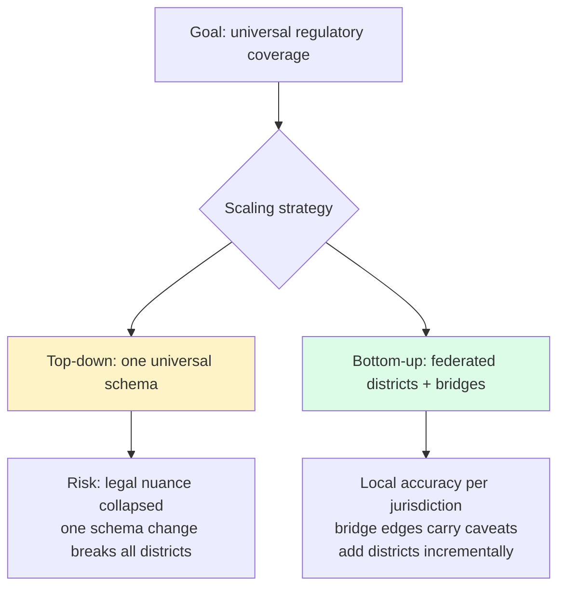
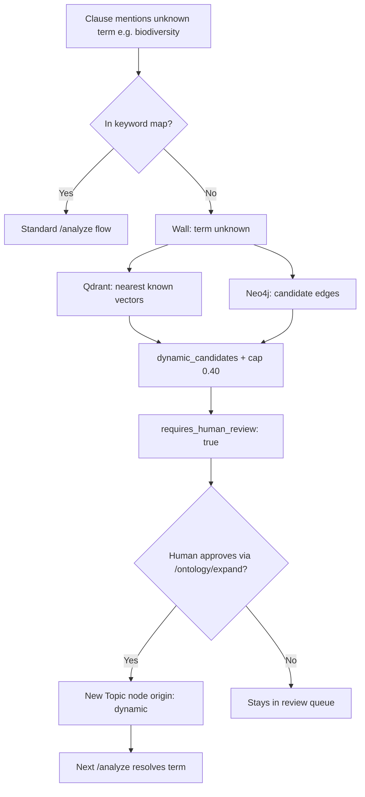

# Understanding the Database Architecture

## A learning guide for the regulatory impact demo

> **What this covers:** Why three databases power this project, how each one works, what breaks if you use Postgres for everything, and how Postgres, Qdrant, and Neo4j cooperate on every `/analyze` call.

---

## Table of Contents

1. [The Core Problem](#1-the-core-problem)
2. [Postgres — The Grid](#2-postgres--the-grid)
3. [Qdrant — The Meaning Machine](#3-qdrant--the-meaning-machine)
4. [Neo4j — The Relationship Map](#4-neo4j--the-relationship-map)
5. [How All Three Work Together](#5-how-all-three-work-together)
6. [Why Not Just Use Postgres for Everything?](#6-why-not-just-use-postgres-for-everything)
7. [The Architectural Decision](#7-the-architectural-decision)
8. [Things That Bit Us During Setup](#8-things-that-bit-us-during-setup)
9. [Key Things to Remember](#9-key-things-to-remember)
10. [Phase Progress](#phase-progress)

---

## 1. The Core Problem

The system needs to answer three completely different kinds of questions for every `/analyze` call:

**Question 1:** Which regulatory chunks are most similar in *meaning* to this policy clause?  
→ Semantic search. Postgres cannot do this natively.

**Question 2:** What does this chunk mean inside the regulatory structure — obligation, jurisdiction, evidence type?  
→ Graph traversal. Postgres can do it with many JOINs, but the structure becomes hard to see in the schema.

**Question 3:** What did we analyze? What did humans decide? What was exported?  
→ Canonical records and audit. Postgres is the right tool.

Each question maps to a different database. That is the entire architectural reason.



---

## 2. Postgres — The Grid

### What it is

Postgres is a **relational database**. Data lives in tables — rows and columns. You query by matching exact values.

### How data looks

| chunk_id | region | framework | topic | status |
|----------|--------|-----------|-------|--------|
| EU_ESRS_E1_001 | EU | ESRS | climate_risk_disclosure | active |
| EU_ESRS_E1_002 | EU | ESRS | ghg_emissions | active |
| US_SEC_001 | US | SEC | climate_risk | active |

### How you query it

```sql
SELECT * FROM regulatory_chunks
WHERE region = 'EU' AND status = 'active';
```

Postgres excels at exact filters. It has no built-in concept of *meaning* — it cannot rank rows by similarity to a sentence.

### Where it lives in this project

Deferred to production in the demo; results are held in memory locally. In deployment, Postgres (Neon) is the canonical source of truth: policy documents, clauses, impact results, confidence scores, human annotations, dataset exports, and timestamped audit events.

---

## 3. Qdrant — The Meaning Machine

### What it is

Qdrant is a **vector database**. Each stored item has a vector — a list of numbers representing *meaning*. You search by similarity, not exact match.

### Embeddings

The Python embedder turns text into vectors (384 floats with `all-MiniLM-L6-v2`):

- `"We disclose climate-related risks annually"` → `[0.032, -0.14, 0.87, …]`
- `"Annual reporting of climate financial exposure"` → `[0.028, -0.11, 0.84, …]`

Similar meaning → similar vectors → high **cosine similarity** (0–1).

### How a point looks in Qdrant

```json
{
  "id": "uuid-from-sha1-of-chunk-id",
  "vector": [0.032, -0.14, 0.87],
  "payload": {
    "chunk_id": "EU_ESRS_E1_001",
    "jurisdiction_id": "EU_ESRS_E1",
    "region": "EU",
    "framework": "ESRS",
    "topic": "climate_risk_disclosure",
    "obligation_id": "OBL_EU_001",
    "status": "active"
  }
}
```

- **id** must be a UUID (string slugs are rejected)
- **vector** is the meaning
- **payload** is filterable JSON metadata

### Search flow



### Payload indexes

Qdrant does not auto-index payload fields. Create **keyword indexes** at collection creation for `jurisdiction_id`, `topic`, `framework`, `region`, and `status` — otherwise filtered search scans every point and collapses at scale. Our shared vector driver creates these indexes automatically on new collections.

---

## 4. Neo4j — The Relationship Map

### What it is

Neo4j is a **graph database**: **nodes** (things) and **relationships** (named arrows). Structure is explicit in the data, not implied by foreign keys.

### Cypher reads like a path

```cypher
MATCH (r:Region { jurisdiction_id: "EU_ESRS_E1" })
      -[:HAS_FRAMEWORK]->(f:Framework)
      -[:HAS_OBLIGATION]->(o:Obligation)
      -[:SUPPORTED_BY_CHUNK]->(c:RegulatoryChunk { id: "EU_ESRS_E1_001" })
RETURN r.name, f.name, o.text, c.citation_label
```

The SQL equivalent needs four JOINs. As the graph grows, Cypher stays readable; SQL accumulates joins until relationships disappear into schema noise.

### EU graph (demo)



### Cross-jurisdiction bridges

Bridge edges carry caveats on the relationship itself — not in a separate junction table:

```cypher
(:Topic { id: "climate_risk_disclosure" })
  -[:TRANSLATES_TO {
      confidence: 0.72,
      caveats: ["EU_requires_double_materiality", "US_investor_materiality_only"],
      reliability: "unverified"
  }]->
(:Topic { id: "us_climate_risk" })
```



### Living ontology

New topics (e.g. `biodiversity_impact`) can be promoted at runtime with `origin: dynamic` — no schema migration. Seeded nodes keep `origin: seed` for auditability.

---

## 5. How All Three Work Together

Every `/analyze` call follows this sequence:

1. **Clause arrives** — e.g. climate disclosure language from a policy draft.
2. **Topic detector** — keyword map → `climate_risk_disclosure`.
3. **Embedder** — clause → 384-dimensional vector.
4. **Qdrant** — filtered similarity search → chunk IDs + `retrieval_score`.
5. **Neo4j** — traverse from chunk IDs → obligations, frameworks, evidence paths → `graph_match_score`.
6. **Confidence scorer** — weighted sum + caps → `final_score`, `requires_human_review`.
7. **Response** — impact status, citations, graph context, match list.



### Confidence formula



Example: `0.84×0.40 + 0.82×0.35 + 0.76×0.25 ≈ 0.81` → after caps and review rules → `confidence_score: 0.78`.

---

## 6. Why Not Just Use Postgres for Everything?

| Need | Postgres | Qdrant | Neo4j |
|------|----------|--------|-------|
| Meaning-based chunk search | ❌ (pgvector is bolt-on) | ✅ Core | ❌ |
| Filter by jurisdiction before similarity | ⚠️ Limited | ✅ Payload indexes | ❌ |
| Region → Framework → Obligation → Chunk | ⚠️ Many JOINs | ❌ | ✅ |
| Bridge edges with caveats | ⚠️ Junction table | ❌ | ✅ On the edge |
| Grow ontology without migrations | ❌ | ❌ | ✅ |
| Canonical records + audit log | ✅ | ❌ | ❌ |

You *could* force one database to do all three — but you fight the tool on two jobs, and the regulatory graph structure stays invisible.

---

## 7. The Architectural Decision

This maps to the product thesis behind the demo: **vector retrieval finds candidates; graph context explains why they matter; Postgres remembers what was decided.**

| Concern | How the demo addresses it |
|---------|---------------------------|
| Vector DB hits similarity walls | Qdrant scores visible on every response |
| Graph DB adds context | Neo4j paths on every matched chunk |
| Static vocabulary | Unknown terms cap confidence and surface candidates |
| Living ontology | `/ontology/expand` promotes topics at runtime |
| Universal coverage | Federated districts + bridge edges |



EU climate disclosure (double materiality) and US climate disclosure (investor materiality) are not the same obligation. Bridge edges with caveats preserve nuance while still enabling cross-jurisdiction reasoning.

### Unknown terms



---

## 8. Things That Bit Us During Setup

### Qdrant rejects string point IDs

Use deterministic UUIDs from SHA1 of `chunk_id`; keep human-readable id in payload.

### Payload indexes before filtering

Indexes must exist at collection creation. Delete and recreate if missing.

### AuraDB username

`verifyConnectivity()` is not enough — run `RETURN 1` with real credentials. Some instances use instance id as username, not `neo4j`.

### Embedder dependency

Replaced Ollama-only embedder with `sentence-transformers` (`all-MiniLM-L6-v2`, 384 dimensions). Collection vector size must match model output.

### Import paths

Use package entrypoints: `shared/graph/index.js`, `shared/vector/index.js`, `shared/events/index.js`.

---

## 9. Key Things to Remember

- **Qdrant IDs:** UUID only; SHA1 helper in adapter; `chunk_id` in payload.
- **Indexes:** Created at collection setup in shared vector driver.
- **Embedder:** Must run before seeding real vectors; dimension **384**.
- **Neo4j auth:** Test with a real query, not connectivity-only checks.
- **Bridges:** Default `reliability: unverified`, cap **0.70** until approved; always return `caveats[]`.
- **Ontology:** `origin: dynamic` vs `origin: seed` for audit trails.

---

## Phase Progress

| Phase | Status | What it proves |
|-------|--------|----------------|
| Phase 0: Module scaffold | ✅ Complete | Module wires into monolith without touching other modules |
| Phase 1: EU + US seed | ✅ Complete | Real vectors in Qdrant, real graph in Neo4j |
| Phase 2: Local analyze | 🔨 Next | Live Qdrant + Neo4j + deterministic confidence on a clause |
| Phase 3: Living ontology | Planned | Unknown terms → candidates → human promote → re-analyze |
| Phase 4: Bridge layer | Planned | EU ↔ US bridges with caveats |
| Phase 5: Frontend | Planned | District → wall → federation narrative |
| Phase 6: Diff + export | Planned | Current vs proposed clause diff + Markdown report |
| Phase 7: Tests + deploy | Planned | Critical-path tests, live URL, README |

**Phase 2 goal:** `POST /analyze` with a sample clause returns real Qdrant matches, Neo4j paths, populated `confidence_components`, and a result id like `RESULT_CLAUSE_001_EU_ESRS`.

---

## Closing thought

Three databases is not complexity for its own sake. Each one answers a question the others cannot answer well. Postgres remembers decisions, Qdrant finds meaning, Neo4j explains structure — and `/analyze` is where they meet.
