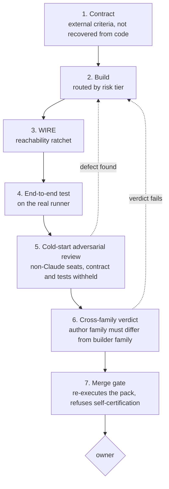

# The development cycle of an agent-built system: seating, routing, and the instruments that were missing

> **Honesty contract.** This paper describes a cycle that ran, not one that is proposed. **(1)** Every internal number carries a repository path, and where the source artifact is inconsistent with itself the inconsistency is printed rather than smoothed. **(2)** Where a figure could not be substantiated from its source, this paper writes *not substantiated* and does not reconstruct it. Section 6.6 lists every such case. **(3)** One headline number used elsewhere in this project, "nine defects", was **withdrawn on 2026-07-26** because it was not derivable from the document supposed to support it; this paper uses the audited replacement throughout and explains the withdrawal in §2.6. **(4)** External references marked *(verified 2026-07-26, this session)* were located by live web search while writing; the remainder were verified by a prior pass on the same date and are re-cited with the URLs that pass returned. **(5)** n is 1. This is one project, one owner, one week of observations, and §7 says so at length.

> **Section status.** §2 through §6 report measurements taken on 2026-07-26 against two repositories at specific commits. Measurements pinned to a commit are labelled; at least one of them (§6.3) has already been overtaken by later work and is retained with its pin because retracting a dated measurement silently is the failure this project exists to prevent. §4's coordination hazards are drawn from dated incident records spanning 2026-07-04 to 2026-07-26; one hazard the author expected to find has **no** recorded instance and is reported as absent.

## Abstract

A small team, in practice one owner directing a fleet of language models, built a reliability kernel for tool-using agents over roughly ten days. This paper describes the development cycle that emerged, as it actually ran: contract, build, wire, end-to-end test, cold-start adversarial review, cross-family verdict, merge gate. For each stage we state what it catches that no earlier stage can, and give the measurement from 2026-07-26 that demonstrates it.

Three findings are worth a reader's time.

**First, seat separation must be by model family, not by name.** A frozen clause requiring this invalidated an existing, fully passing verification pack the same day it was adopted, because the pack's author and the unit's builder were both Anthropic models. Knight and Leveson's 1986 result, 27 independently written programs and one million test cases producing far more coincident failure than independence predicts, is the reason a different name is not independence, and is also the reason that varying the *frame* given to each seat matters as much as varying the model. This project has the frame mechanism and did not use it in the run that produced its headline findings; that is stated as a gap, not a feature.

**Second, some of this work must be sequential and the ordering is not arbitrary.** Custody defects must be fixed before the pack that judges them, and the pack before the wiring, because wiring converts latent defects into live ones. Other work parallelises cleanly: independent verification tracks over disjoint file sets, and multiple assessors over one artifact. The observed coordination hazards are all in the shared working tree, and every one of them is recorded with a date.

**Third, and most useful to a reader, this project built sealed holdouts, mutation scoring, adapter differentials and cross-model adversarial review while having no code coverage, no static type checking, and no test-running continuous integration in the kernel repository at all.** Coverage over the composed path would have printed the founding defect, a durable component invoked zero times during a complete run, on day one. A type checker would have printed a caller passing one argument to a function requiring three. The instruments were exotic; the tape measure was missing.

We close with the losses. A benchmark against a conventional stack of scoped tokens, branch protection, code owners, required checks and a policy engine loses five of nine rows. Twenty-three effect routes were enumerated and one reaches the authoriser. Detection of a component that lies about doing its job scores zero out of five. And cross-model adversarial review is **not** independent verification and validation in the IEEE 1012 sense, a correction this project's own contract now carries in normative text.

## 1. Introduction

### 1.1 What is being described

Two repositories are involved. **Cortex** is the corpus, the tooling, the seating engine and the evaluation lab. **SCC v2** is the kernel under construction: a reference monitor over agent-initiated effects, with a policy gate, a sole-writer broker, content-bound receipts and durable state. The kernel is written almost entirely by language models under a frozen contract, and verified by other language models under rules the contract also freezes.

The interesting object is not the kernel. It is the cycle that produces it, because that cycle has to answer a question conventional software process does not face in the same form: **the producer is fluent, tireless, and produces work that looks finished whether or not it is.** Every stage described below exists because some earlier stage failed to notice that.

### 1.2 Why "looks finished" is the governing constraint

The founding defect of this project is recorded in a holdout pack, `scratchpad/holdout-115-opus5/PACK-115.md`, and reads:

> "composition writes a deletable JSON projection named `approval_receipt` and never calls the receipt store, so `receipts.db` is 0 bytes after a full run and **the receipts component is invoked zero times**."

The receipt store existed. It had tests. Those tests passed. The composition module that was supposed to use it also had tests, and those passed too. Nothing in the unit-testing regime asked whether the two were connected, and the answer was no.

This shape recurs. A measurement of the Cortex package on 2026-07-21 found **45 of 156 modules unreachable from any console-script entry point, 9,930 lines, 16 percent of the package** (`tests/test_wiring_reachability.py` module docstring). Every one had been built correctly, tested, and never connected. The docstring's diagnosis is the thesis of this paper in one sentence:

> "A work unit's definition of done stops at 'module + tests + closeout' and never includes *and something calls it*."

### 1.3 What this paper is not

It is not a controlled experiment. Nothing here was randomised, nothing has a control arm, and the comparison in §6.1 has one column measured and one column modelled from vendor documentation. It is a description of a process with its measurements attached, offered because the measurements include the losses.

## 2. The cycle

Seven stages. Each exists because of a defect the previous stage let through.



### 2.1 Stage 1, contract, and the circularity it removes

The kernel sub-contract (`contracts/modules/SCC-V2-SUBCONTRACT-KERNEL-DRAFT-2026-07-17.md`) was frozen v1.0 on 2026-07-17 and amended to v1.1 and then v1.2 on 2026-07-26. Section 12.1 states what the kernel **is**, in terms it did not author:

> "The kernel is a **reference monitor** (Anderson 1972) over agent-initiated effects ... It MUST satisfy the following, which are published criteria this project did not author and cannot amend": R1 complete mediation (Anderson 1972 [1]; Saltzer and Schroeder 1975 [2]), R2 tamper-proof, R3 verifiable, R4 fail-safe defaults, R5 least privilege, R6 no ambient authority.

The rationale is the load-bearing part:

> "**Why these, and not a list of our own.** A specification derived from the implementation cannot falsify the implementation; it can only agree with it. R1-R6 predate this project by decades, so the kernel can be found WRONG by something that is not us. A first draft of this amendment proposed behaviours recovered from the code's own comments and was rejected by the owner as circular."

The circularity was real and measurable. Amendment 01's section A5 records that `composition.py` declares "Behaviors 1-7 are enforced in this module" and cites them as normative **in 20 separate places in the code**, while "the word 'behavior' appears **zero times in the contract**". All three cold-start assessors independently reported having to infer the specification from the code's own comments.

**What this stage catches that nothing later can:** the difference between a defect and a bookkeeping error. Amendment 01 states it exactly:

> "Under **B4 alone** (circular), #119 reads as *'our comment was inaccurate'*, an internal bookkeeping error, and one we could equally have resolved by editing the comment. Under **R1 complete mediation** (external), the same defect reads as *'the reference monitor does not mediate completely; check and effect are not bound to the same object'*, a named, citable failure against a standard published in 1972, which cannot be resolved by editing anything of ours."

Standing recorded at adoption, so that progress is measurable rather than asserted: **R1 FAILS** (issue #119, a time-of-check to time-of-use window between the hash checked and the payload applied), **R2 UNVERIFIED**, R3 plausible, R4 holds, R5 and R6 partial.

### 2.2 Stage 2, build

Build is routed, not chosen. Section 3.4 covers the routing rules. The stage catches nothing by itself; it is included because the seat that performs it constrains every later stage, and because the run in question showed that letting the orchestrator default to building is itself a defect (§3.5).

### 2.3 Stage 3, WIRE, and why it is a separate stage

A unit that passes its holdout and is called by nothing is not done. This project separated wiring into its own stage and its own methodology entry, M30, whose statement is:

> "**M4 proves a unit is correct against its contract. M30 proves the units are connected.** A unit can pass a sealed holdout with every mutant killed and still be wired to nothing, that is precisely what happened. Run both." (`docs/methodology/WORK-METHODOLOGIES.md`)

The mechanism is a ratchet rather than a threshold, `tests/test_wiring_reachability.py`, 5 test functions and 7 collected cases. The current orphan set is recorded in a baseline file; a **new** orphan fails the suite, and an orphan that gets wired must be **removed** from the baseline, which the test also enforces, so the baseline can only shrink. The design note explains why it is not a cliff:

> "Deliberately not a cliff: failing on all 45 today would just get the test disabled, which is how gates die."

The gate also refuses to be its own first violation: `assert "wiring" not in orphans`, with the message "wire it in pyproject.toml before trusting this gate".

**What this stage catches:** every defect of the form *correct component, no caller*. The kernel's own instance of this is quoted in §1.2. A second instance was found in the same week in `runtime/tool_broker`: the content-verification function is pure, correct, has 34 passing probes against it, and, per the holdout report, "is **not yet called from `broker.py`** ... **A correct gate nobody invokes mediates nothing**, and R1 complete mediation is a statement about the *call site*" (`reviewed/step3-g2-holdout-2026-07-26.md`).

### 2.4 Stage 4, end-to-end test on the real runner

Unit 37 built the evidence flow: receipts from a real kernel run, published to a separate `evidence` branch, verified by a GitHub Action that must refuse a bad bundle. The builder's record (`reviewed/step7-evidence-flow-2026-07-26.md`) reports a real run `115f5443-277e-475a-ab83-98dc4d90a000` producing 4 receipts, a bundle with sha256 `1133f22e...`, and **8 distinct non-zero refusal exit codes demonstrated on real hosted runners plus a positive control**: missing bundle 3, tampered bundle 4, hash mismatch 5, incomplete fields 6, redaction leak 7, invalid declaration 9, unsigned key rotation 10, and PASS 0. A ninth code, attestation missing, was demonstrated locally only, and the record says so. Local suite 98 passed, on-runner 73 passed.

**What this stage catches that local testing cannot**, in the builder's own words:

> "**The first real Action run refused its own PR with exit 10 (KEY_ROTATION_UNSIGNED).** The rotation guard fired on the PR that *introduces* `attestor.pub`, there is no base copy to swap on that PR, so the guard was forbidding its own precondition and the key would have been unlandable."

And a second, invisible to any unit test: "a Windows CRLF translation in the proof harness changed bundle bytes and correctly tripped the canonical-form check". The same stage caught three leaks in the redaction control itself, including a real infrastructure hostname committed inside the module whose job is to keep hostnames off a published branch. The lesson recorded is a good one: "*A leak fixture must trip the RULE, not carry the SECRET.*"

### 2.5 Stage 5, cold-start adversarial review

Three non-Anthropic seats, grok (xAI), glm (Zhipu) and kimi (Moonshot), were given the frozen contract and two source files and nothing else. Explicitly withheld: the test directory, the self-check, every review, every design document, the audit log, and the existing holdout. They ran 4, 4 and 4 attack rounds in 317, 337 and 260 seconds respectively, wrote their own scripts, and produced approximately 49 tests between them (20, 17, 12), none derived from this project's existing suite.

**What it catches:** defects that the entire scripted regime is structurally unable to see, because the scripted regime tests what its author already imagined. The target module's sealed holdout scores 26 of 26.

**The audited count, and it is the count this paper uses everywhere:**

- **11 issues raised** across three seats.
- **11 reproduced** by the orchestrator with independent scripts.
- **10 distinct** after merging one duplicate pair.
- **6 code defects**, **4 contract ambiguities** where the module's stated threat model already excludes the attack.
- **1 of the 6 is fixed and regression-tested** (commit `1ea5d4f`).
- **0 of the other 10 have any regression test.**
- **All 11 are latent, none live**, because the module has no production caller.

Source: `reviewed/evidence-ledger-coldstart-2026-07-26.md`, section 0.

### 2.6 The number that was withdrawn, and why it belongs in the paper

Until 2026-07-26 this project's presentation, its case study, and **the frozen contract itself** asserted that the cold-start run found **nine defects**. An external reviewer called that an anecdote rather than an auditable claim. The resulting audit reached this verdict:

> "**The claim as stated is not supported by its own source document, and the number should be lower than nine on one reading and higher on another, the underlying report gives three mutually inconsistent counts.**"
>
> "Nine appears twice, in two incompatible framings ('nine found / seven reproducible' and 'eleven raised / nine reproduced'), and matches the evidence table in neither. **No selection of nine rows out of the eleven is identified anywhere in the document.**"

The replacement headline is weaker and checkable, which is the trade this paper endorses:

> "*Three models from three vendors, given the frozen contract and the implementation but none of our tests, probes, mutants or prior conclusions, raised eleven issues against a module whose sealed holdout scores 26/26. All eleven were independently reproduced. Six are code defects the holdout does not test for; one of those was fixed the same day under a regression test authored by a different model family. Every one of them is currently latent, because the module has no production caller.*"

Two corrections travel with it, both from the same audit. **The brief supplied the attack surface.** The source report claimed the seats "invented every test" and that the tests came from nowhere in this project; the audit found the brief listed ten attack families verbatim, and that **seven of the eleven findings map directly onto a prompted family**. The honest form: the seats invented every *script*, and **four of eleven** findings came from an angle nobody handed them. **And "shown only the code" is half right**: never the tests is true, and stronger than stated because no committed test source exists for that module at all, but the frozen contract was also supplied.

A stricter count is also on record and this paper does not dispute it: compressing four findings that share a root cause yields **8 distinct issues**.

### 2.7 Stage 6, cross-family verdict

Unit 37's independent verdict was authored by **grok-4.5, family xAI**, on a free lane, with the builder seat excluded by rule. The assessor authored its own mutation specification, ran the pack and the harness itself, decided PASS, and wrote every word of the verdict file. Numbers: **18 probes, 18/18 at baseline and after revert; 10 assessor-authored mutants, 10/10 killed**, including the two that matter most for a refusal-shaped program, `return result.code` rewritten to `return 0` and `sys.exit(main())` rewritten to `sys.exit(0)`, plus five refusal branches rewritten to success. **Adapter differential CLEAN**: four faults seeded at the pack-to-unit boundary flipped the pack from 18 passing to 5, 5, 0 and 12.

The record also states the residual honestly, which is why it is quotable:

> "The honest residual: **the harness was authored by a Claude seat**, so the *shape* of what was measured is not fully family-independent even though the *judgement* and the *mutants* are ... A future run should have the assessor seat author the probe pack too."

### 2.8 Stage 7, merge gate

The gate re-executes the unit's holdout pack in a throwaway worktree and refuses a pull request that has no independent verdict. On unit 37 it refused the builder first:

```
VERDICT-GATE: BLOCKED for unit 37
  - no verdict file at .../verdicts/37.md (no independent verdict, no merge)
```

The builder's record of that moment is the clearest statement of what a mechanical gate is for:

> "I built this unit, so authoring `verdicts/37.md` myself is precisely the self-certification the gate refuses. **I did not touch, relax or bypass it** ... Two gates now refuse this work for two different reasons, and both refusals are correct."

After the grok verdict landed the gate returned `GATE EXIT=0`, with a wall time of approximately 90 seconds, "which is itself the evidence that re-execution actually happened". Since 2026-07-26 the gate resolves seat family through `cortex_core.seating.SEAT_FAMILY` and **refuses a same-family author and builder pair, failing closed on any seat it does not recognise**.

### 2.9 What each stage catches that the previous cannot

| Stage | Catches | Cannot catch | Measured instance, 2026-07-26 |
| --- | --- | --- | --- |
| 1 Contract | Circular specification; a defect that could be resolved by editing a comment | Anything about the code | "behavior" appears 20 times in the code as normative, 0 times in the contract |
| 2 Build | Nothing on its own | Its own blind spots | Orchestrator seat was the default hard-task builder (§3.5) |
| 3 Wire | Correct component, no caller | Whether the component is correct | 45 of 156 modules unreachable; receipt store invoked zero times |
| 4 End-to-end | Environment, ordering, first-run and encoding faults | Adversarial input the author did not imagine | Guard forbade its own precondition, exit 10; CRLF tripped canonical form |
| 5 Cold-start review | Attacks outside the author's imagination | Whether the finding matters in the deployed system | 11 issues on a module scoring 26/26; all 11 latent |
| 6 Cross-family verdict | Same-family shared blind spots; a suite that measures its harness | Frame effects shared by all seats given the same brief | Adapter differential flipped 18 to 5, 5, 0, 12; 10/10 mutants killed |
| 7 Merge gate | Self-certification; unreproducible evidence | Whether the verdict was correct | Blocked its own builder; approximately 90 seconds of real re-execution |

Note the asymmetry that matters: **stage 5 finds the most and proves the least**, because everything it found was latent. Stage 3 is what converts latency into liveness, which is the whole subject of §4.1.

## 3. Seating

### 3.1 The clause

Contract §12.4, verbatim and complete for the two clauses at issue:

> "**Adapter independence.** A unit's holdout verdict is VOID unless the pack's adapter differential is CLEAN, i.e. seeded faults in the test adapter change the verdict. A pack that cannot distinguish the unit from its harness proves nothing about the unit.
>
> **Cross-family verification.** The seat authoring a unit's sealed holdout MUST NOT be the seat that built it, and MUST NOT be of the same model family. A different model name is not independence, and neither is this clause. It buys diversity of training data and failure modes, which is why it catches things (it invalidated the prior G2 pack and forced today's rebuild). It does NOT constitute independent verification and validation in the IEEE 1012 sense, and no artifact of this project may describe it that way."

The clause is unusual in stating its own limit in normative text. §6.4 returns to that.

### 3.2 The concrete result: a passing pack voided

Issue #33 already carried a green verification: a pack at `scc-v2-g2-holdout`, **25 of 25 probes, 9 of 9 mutants killed**, fingerprint `95ba9d27...`. It was declared void on 2026-07-26, the day §12.4 was adopted, on **two independent grounds, either sufficient** (`reviewed/step3-g2-holdout-2026-07-26.md` §0):

| §12.4 clause | Old pack | Status |
| --- | --- | --- |
| Holdout seat must not be of the same model family as the builder | Unit built by **Claude Fable 5** (commit `06c9eec`, `Co-Authored-By: Claude Fable 5`); pack `binding.json` records `"author_seat": "holdout-author-opus5-role"` | **same family, Claude and Claude**, void |
| Adapter differential must be CLEAN | Old pack has no adapter differential of any kind | **absent**, void |

The pack was rebuilt from scratch by a non-Anthropic seat, GLM-5.2, driven headless from a grey-box packet with the implementation and the existing tests withheld and the repository map disabled so no implementation could leak. Result: **34 probes, 34/34 against the product unit and 34/34 against an independent reference implementation; 13 seeded mutants, 12 killed and 1 adjudicated equivalent by a mechanically re-checked predicate; 10 lying adapters, 8 faults detected and 2 adjudicated equivalent, differential CLEAN; six deliberately broken builds all driving the suite red.**

The rebuild found three holes **in the pack itself**, all by gates rather than by inspection: a mutant that survived, an adapter fault no probe reacted to, and a broken build that deleted the always-verdict guard and still scored a full green. It also measured its own tautology floor: **with the unit never called at all, 33 of 34 probes still pass**, caught by the reachability check and not by any probe.

### 3.3 Why family, not name: Knight and Leveson

Knight and Leveson [3] had 27 programs written independently from one specification and ran approximately one million test cases against them. The individual programs were reliable. **Coincident failures far exceeded the number expected under independence, at statistical significance.** The mechanism is that independent *construction* does not produce independent *failure*: the specification is finite and sometimes ambiguous, and people with shared training misread it the same way.

Transposed to models, the argument does two things at once.

**It justifies the family rule.** Two Anthropic models share pretraining distribution, post-training regime, and the resulting habits of what "obviously" needs checking. Renaming the seat changes nothing about the correlation. The G2 result is the empirical form of this: the same-family pack scored 25/25 and its cross-family replacement, on a superset of the same behaviour, immediately exposed a tautology floor of 33/34 and three holes the first pack did not have the shape to find.

**It also bounds the family rule, and this is the part that is usually dropped.** If shared *specification* is a sufficient cause of coincident failure, then changing the model while holding the brief fixed leaves a large part of the correlation in place. **The frame is a variable too.** This project has the mechanism: `ops/coldstart.py` issues three differentiated per-seat charters with the contract withheld. It did not use it for the run that produced the §2.5 findings. The audit says so plainly:

> "**All three seats received an identical brief.** There were **no** differentiated charters in this run."

and, of the charter tool, that "the findings in this ledger were not produced by `ops/coldstart.py` and cannot be reproduced by running it". So the strongest available reading of the evidence is: **model diversity was varied and produced findings; frame diversity was designed and not yet exercised.** The prompted-family correction in §2.6, where seven of eleven findings map onto an angle the brief handed the seats, is direct evidence that the frame was doing a large share of the work.

### 3.4 Risk-tiered routing

Seating is resolved in code (`cortex_core/seating.py`). The module docstring gives its reason for existing, and it is an incident:

> "On 2026-07-25 the orchestrator nearly dispatched `opus5` (a Claude seat) to author a holdout for a unit built by a Claude agent, which violates the cross-family rule ... It was caught by recall, not by a mechanism. This module is the mechanism."

Structure worth noting:

- **Family is a fact, not a policy.** `SEAT_FAMILY` maps seat to vendor and is documented as "FACTUAL (which vendor trained the model), not policy". A seat absent from the map "resolves to 'unknown' and is refused for any constrained role rather than guessed at".
- **Risk is a property of the work, not the seat.** The code comment is exactly that: `# Difficulty of the WORK, not of the seat.` Two tiers, `RISK_ROUTINE` for wiring, mechanical edits and following a frozen pack, and `RISK_HARD` for novel design, contract authoring and adversarial judgement.
- **Routine work routes cheap-first.** The chain is walked in reverse with expensive seats appended last, commented `# expensive only as a last resort`.
- **Adversarial review routes to the free non-Claude fleet.** `FREE_FLEET_ONLY` holds grok, glm and kimi. The unit 37 verdict used one of them and no paid or Anthropic seat was used for any part of the assessment.
- **Refusing beats guessing.** `NoEligibleSeat` is raised, with every rejection reason, rather than returning a seat that breaks a rule. The independence check is also applied as a postcondition at verdict-write time "so an invalid pairing cannot be recorded, not just avoided at selection time".
- **No model seat is ever the verdict.** Asking the engine for the reproducer role raises: the reproducer is deterministic continuous integration.

### 3.5 The orchestrator must not be the default builder

This defect was found and fixed on 2026-07-26. The seating engine's hard-task branch returned the orchestrator seat, which meant the seat that plans and verifies the work was also, by default, the seat that writes it. The fix comment is the clearest statement of the principle in the corpus and is quoted in full:

> "1. Recorded policy: sol@xhigh is the hard-task lead post-Fable ... Returning `opus5` here meant the seating engine did not implement the policy it exists to encode, sol was in the chain but NEVER selected for any role, because the chain is strongest-first and opus5 sits ahead of it.
> 2. `opus5` is the ORCHESTRATOR seat. Defaulting hard builds to it means the seat that plans and verifies the work is also the seat that writes it. That is the self-certification the cross-family rule exists to stop, arriving through the back door: §12.4 forbids a same-family AUTHOR, and this made same-family the default BUILDER. Fable building the custody trio it could then not verify is the same shape, and it cost a full rebuild today."

Two things are worth extracting. First, a rule expressed only as a prohibition on the *author* leaks through the *builder*, because the constraint is on the pair and only one element of the pair was checked. Second, the failure was silent: the policy document named sol as hard-task lead, the seat was present in the chain, and it was **never selected for any role** because a stronger seat sat ahead of it. A policy that is encoded but unreachable is indistinguishable from a policy that was never written, and only exercising the router revealed the difference.

### 3.6 The second lineage, and a stage that ended negative

Not every application of this regime ends green, and a paper that showed only the green one would be misleading. Issue #34, the custody subsystem, carried an owner-visible green from 2026-07-25: **24 of 24 probes, 8 of 8 mutants killed, "No RED defects"**. Amendment 01 was adopted one day later. Re-verified under the new regime by a grok-authored pack (30 probes, given the requirement text and the sources but no prior finding, no prior verdict, and no hint of which direction the answer lay), the outcome was:

> "**R2 CANNOT be moved from UNVERIFIED to HOLDS. It is REFUTED for this subsystem, and the question is additionally moot in the deployed kernel because the subsystem is not wired into it.**"

Five custody defects, F1 through F5: custody of a receipt can be transferred to another run with no integrity check of any kind; custody can be erased silently; an interrupted mint is byte-identical to a legitimate unbound one; the single-writer guard is disabled by a public constructor argument; and recovery returns durable state for a run identifier the server never issued. The report's diagnosis is a single sentence worth carrying: "**The subsystem authenticated the *values* and left the *membership* unauthenticated.**"

The regime's own numbers on that run were poor and were reported as poor: **mutant kill rate 10 of 22, 45 percent**, with eight survivors classified as genuine suite holes; **adapter differential NOT CLEAN**; tautology floor 1 of 30. The recommendation was to close the issue as VERIFIED-NEGATIVE rather than green. And the reason the earlier green was not a lie is stated too: "**Nothing in the 24 probes could have detected F1-F5**, because the standard they would have been measured against did not exist yet."

## 4. Routing: what must be sequential, what may run in parallel

This section is deliberately concrete. Abstract advice about parallelism is worthless; the ordering constraints below come from specific measurements.

### 4.1 What must be sequential, and the ordering rule

**The rule: fix custody defects, then fix the pack that judges them, then wire. Wiring first converts latent defects into live ones.**

Each clause is evidenced.

**Wiring is what makes a defect live.** Every one of the eleven cold-start findings is latent, and the ledger states the reason without hedging: "**All 11 are latent, none live** ... `composition.py` has no production caller." The custody subsystem is the same: `build_substrate`, `StoreCustody`, `CustodialReceiptStore` and `RecoveryEngine` are "referenced **only by their own tests**", and three of the custody accessors "have **no caller anywhere in the repo**, verified by grep". This is uncomfortable in one direction and useful in the other. It means the project's headline findings are findings about code that cannot yet hurt anyone; it also means the project currently has a window in which fixing them is cheap. Wire first and that window closes, because the same defects become production defects with users and durable state behind them.

**The pack must be trustworthy before the verdict means anything.** The ordering here is not a preference; it was forced by a measurement. Unit 115's sealed holdout scored 26 of 26. So did **four deliberately lying adapters** (`reviewed/ADJUDICATION-OQ3-unit-115-2026-07-26.md`):

> "**Four deliberately-lying adapters also score 26/26.** The pack cannot distinguish 'composition implements the approval gate' from 'the operator adapter implements it.' So **26/26 is not evidence that the kernel works**, it is evidence that the adapter-plus-kernel pair satisfies the probes."

This is Jackson's world and machine distinction stated in operational terms [4]. A requirement R is satisfied by specification **and** domain assumptions, S together with D, never by S alone. The pack demonstrated `S_kernel AND D_adapter |= R` and never isolated `S_kernel`; the lying adapters are simply different `D`s that also satisfy R. It is also, precisely, a **pseudo-tested unit** in Niedermayr's sense [5]: delete the enforcement, let the adapter supply it, and the verdict stays green. Niedermayr's group found pseudo-tested methods in every analysed project, at a median of roughly 10 percent of methods, which is the general form of what this project found in one place.

Closing that defect (issue #116) came before trusting any verdict from the pack, and produced a measurable improvement plus an honest residue: **blind adapter faults went from 3 to 1**; a null adapter that does nothing scores **6 of 28**, so the **evidence ceiling of a green run is 22 of 28 probes**; one fault was proven an equivalent mutant with a self-revoking predicate, so that "if a future build reverts to mint-and-apply, the broker is reached, the predicate goes false, and A10 counts as blind again. **The waiver cannot rot**"; and one fault, `A5`, was **left red on purpose** because closing it would require a probe that names an internal function, which the pack's own independence rule forbids. That is the world and machine gap again, and the report says so: the pack "is a *pseudo-tested unit* detector on every axis except this one".

**Adjudication comes before rebuilding.** When the pack and the kernel disagreed about which binding was authoritative, the resolution was an owner ruling, not a code change by either side: "the kernel is correct; the pack was defective", with the contract line cited. The fix widened one helper to accept either contract-permitted binding and touched nothing else, on the stated grounds that "retiring the probes would have thrown away three genuine checks to make a number go up".

### 4.2 What may run in parallel

**Multiple assessors over one artifact.** The cold-start run put three seats on the same two files simultaneously, in isolated harnesses with no channel between them. This is legitimate because the seats produce *inputs and scripts*, not verdicts, and because nothing they produce is merged: each seat's findings are re-driven independently before any of them counts. Cost was 260 to 337 seconds per seat, wall-clock roughly the cost of one.

**Independent verification tracks over disjoint file sets.** The three step-lanes of 2026-07-26, the G2 holdout on `tool_broker`, the custody verification on `durable_state`, and the evidence flow on `ops/evidence`, ran against non-overlapping directories. This is the shape the project's own research recommends and partially enforces: tasks declare path claims and the server rejects concurrent claims with intersecting sets, with the phases expressed as dependency edges. The design note is blunt about why this belongs in the ledger rather than in a prompt: "**Boundaries enforced by the ledger, not by prompts, this is the entire 'parallel agents never race' guarantee, and it's about 30 lines.**"

**Bounded hypothesis fan-out.** The methodology entry for parallel work, M28, is scoped to debugging and explicitly not to building: "Scope is SHORT-TO-MEDIUM: a bounded, minutes-long burst of 3 to 5 parallel testers, NOT a long-running build."

**What may not run in parallel** follows from §4.1: any two tasks whose file lists overlap, and any task whose input is another task's output. The project's own formulation is "if two tasks have overlapping file lists, they need to be sequential, not parallel".

### 4.3 The coordination hazards actually observed

Every item below is a dated incident record, not a hypothetical.

**One agent committing another's in-progress work. Observed 2026-07-06.** A closeout records the commit that carried its work as "(backend + docstring + tests, **swept into the branch by a concurrent `git add -A`**)". Multiple shard agents were committing into one workspace; twenty test failures in the full suite were attributed to concurrent churn by two independent closeouts. A later handoff carries the mitigation as a flat prohibition, "**NEVER `git add -A` or `git add .`** ... Stage ONLY the intended files by explicit path", though for a different stated reason (untracked file volume) and with no cross-link to the 07-06 incident.

**Shared working tree, with real data loss. Observed 2026-07-19.** A commit carrying a risk classifier and a ledger note "was dropped in a branch rewrite while Codex held the shared checkout, M11 collision incident with real data loss, cherry-picked back". The recommendation recorded alongside it: separate git worktrees for any co-active session, because "shared-checkout is lossy".

**Branch switching under a running agent. Observed 2026-07-18.** A holdout run was corrupted mid-flight when an orchestrator branch switch briefly removed committed-but-unmerged sources from the shared tree; one probe silently used a vendored stand-in. Re-run clean after restore. Lesson recorded as a rule: "**no branch-hopping in the shared tree while lane agents run**". It is now methodology M11: "Before any git operation in a possibly-shared checkout, check `git branch --show-current` ... **Never switch branches under a running agent.**"

**Cleanup destroying uncommitted work. Observed 2026-07-11.** A worktree merge failed silently (git refused the commit for dubious repository ownership, so the commit became a no-op), the deliverables stayed uncommitted, cleanup ran `git worktree remove --force`, and two finished deliverables were permanently lost. The resulting gate defines merge completion as "present on disk AND committed at HEAD in the target tree, not before".

**Concurrent editing producing a false signal. Observed 2026-07-26.** During the benchmark run, one test invocation showed 35 failures and 5 errors in a directory the benchmark author did not own; the same command later returned clean. The author's note is the right handling: "**Another agent was mid-edit** ... I did not investigate, because `durable_state/` is off-limits for this task. Treat the clean number as a snapshot of a moving repo."

**Two agents editing the same file and one write being lost: no recorded instance.** This is stated because the author looked for it. The risk is named in design documents from 2026-07-15 and 2026-07-17, and it is actively routed around, twice on 2026-07-26 alone (mutants applied as in-memory source substitutions in a child process rather than on disk "because other agents are working in this repo right now"; a probe file written into the oracle's own directory because "a test that drops scratch files into someone else's working directory is its own defect"). But **no dated incident of an actual lost write from concurrent same-file editing exists in either repository.** Nor is there any record of git index lock contention, which the worktree-per-agent pattern removes structurally rather than manages.

The mitigation with the best record is architectural rather than procedural, and it is one line of a publisher's contract: "**THE WORKING TREE IS NEVER TOUCHED.** Publishing uses git plumbing against a throwaway index ... No checkout, no branch switch, no stash. **Other agents work in this same clone concurrently; a publisher that switched branches would corrupt their runs.**"

### 4.4 Custody of parallel evidence, the hazard nobody plans for

Parallel runs generate evidence in places that are not the repository, and it evaporates. The cold-start audit found a notes file cited twice in the report that "**does not exist**", and that the harness and every reproduction script "live only in session temp, in **neither repository**". A separate seal break is recorded in the adapter-independence work: two new probes "are NOT in the commit", with the consequence that "**the committed tree cannot run either tool**".

This is the same defect class as §1.2 at one level up. The work was done, it was correct, and nothing connected it to the artifact that is supposed to hold it.

### 4.5 Convergence as evidence, and its ceiling

The strongest single datum produced by the whole regime is a convergence:

> "**A non-Claude seat, given only the requirement text and the sources, independently wrote a probe that finds the same defect** and described it in its own words as *'the state recover decisions rest on must not be forgeable into a claim the record does not support'*. Two instruments, no contact between them, same defect. That is the strongest single piece of evidence in this document."

Three limits apply, and this project states all three itself.

1. **Convergence bounds nothing.** Knight and Leveson [3] is the direct authority: agreement among independently constructed versions is a much weaker signal than independence would predict, so two instruments agreeing is evidence about one defect and no evidence at all about the defects neither found.
2. **The confirming party was not independent.** In the cold-start run, "the confirming party was the orchestrator (Claude Opus 5), a *different harness*, not a *different party*", and the contract bars a Claude orchestrator from certifying Claude-built code. The audit's resolution of that is precise and is the right one: "**these are convictions, not certifications**". Or, as the custody report puts it, "**a Claude orchestrator may not certify Claude-built code, but it may convict it.**"
3. **A shared brief re-correlates the seats.** §3.3 and §2.6, seven of eleven findings tracked a prompted attack family.

## 5. The instruments that were missing

This is the section a reader is most likely to be able to use.

### 5.1 What existed and what did not

By 2026-07-26 this project had built: sealed grey-box holdout packs with pack hashes and target fingerprints; mutation scoring with adjudicated equivalent mutants; adapter differentials that seed faults into the test harness to prove the suite measures the unit; deliberately broken builds as red-proofs; cross-model adversarial review from three vendors; a merge gate that re-executes packs in throwaway worktrees; a reachability ratchet; and a provenance vocabulary for every recorded number.

It did not have, in the kernel repository, any of the following:

| Instrument | Kernel repository, state at last commit | Cortex repository |
| --- | --- | --- |
| Code coverage configuration | **Absent.** No `.coveragerc`, no `[tool.coverage]`, no `pyproject.toml` at all | **Absent** from configuration; a coverage step written 2026-07-26, uncommitted at the time of writing |
| Static type checking | **Absent.** No mypy, pyright, or any type-check configuration | **Absent** from configuration; an advisory mypy step written 2026-07-26, uncommitted |
| Continuous integration that runs the tests | **Absent.** Two committed workflows, both process gates: is an issue linked, is there an independent verdict | **Present since 2026-07-02**, matrix of two operating systems and three Python versions |

The kernel repository's own new workflow file states the situation better than any summary could:

> "**WHY THIS DID NOT EXIST UNTIL 2026-07-26, which is the point:** this repository had THREE workflows, verdict-gate, linked-issue-gate, evidence-verify, and every one of them checks PROCESS (is there an independent verdict, is an issue linked, is the evidence bundle valid). **Nothing ran the kernel's own tests on a pull request.** The repo whose entire purpose is mechanical enforcement had no mechanical check that its code worked."

One precision: only **two** of those three workflows are committed, so the committed baseline was two process gates rather than three.

### 5.2 What each missing instrument would have caught, on day one

**Coverage over the composed path would have printed the founding defect directly.** From the same workflow header:

> "The defect that started all of this was 'the durable receipt component is invoked ZERO TIMES during a complete composed run'. Coverage measured over an end-to-end run states that directly: a module at 0% during composition is not wired, whatever its own unit tests say. This project built sealed holdouts, mutation scoring, adapter differentials and cross-model adversarial review, and never ran `pytest --cov`. **The exotic instrument was reached for; the tape measure was not.**"

The design detail is worth copying: coverage is configured as a **ratchet, not a threshold**. "A hard percentage gate would be gamed or disabled; a 'this was wired yesterday and is not today' signal is the one that matters." This is the same shape as the reachability baseline in §2.3, and the same stated reason: a gate that is pure friction gets turned off.

**A type checker would have printed four of fifteen recorded wiring failures in half a second:**

> "The first end-to-end wiring audit found a caller passing ONE argument to an authorisation function requiring THREE, a caller expecting a dict where the real result is a typed object, and a caller reading a field that does not exist. Those are not subtle integration bugs; a type checker prints them in half a second. **Four of fifteen recorded wiring failures were of exactly this shape.**"

**Running the gate's own tests would have caught a gate that could not run.** In Cortex, the verdict gate lives outside the test directory, so the standard invocation never touched it: "the gate that enforces 'no independent verdict, no merge' was itself untested in CI, and its suite could not even be collected on 3.11 (a 3.12-only f-string), so it had never run locally either."

### 5.3 The lesson, stated plainly

**AI-generated code looks finished.** It compiles, it is commented, it has tests, and the tests pass. That surface completeness removes the ordinary prompt to reach for a basic measurement, because basic measurements feel beneath work that already looks done. What it leaves untouched is precisely the class of defect that surface completeness cannot signal: whether the pieces are connected, whether the callers and callees agree in shape, and whether anything ever executed the composed path.

So teams in this position reach for the exotic instruments, sealed holdouts, mutation scores, adversarial review, because those match the perceived sophistication of the problem. The exotic instruments are good, this paper's §2 and §3 argue for them, and they are also **the wrong first purchase**. Coverage over the composed path and a type checker are cheaper by orders of magnitude, run in seconds, need no second model, no charter, no seat family, and no adjudication, and would have caught the founding defect and roughly a quarter of the recorded wiring failures in this project before any of the sophisticated machinery was written.

The ordering advice is therefore uncomfortably boring: **buy the tape measure first.**

## 6. Honest limitations

### 6.1 The benchmark against a conventional stack loses five of nine rows

A comparison was run on 2026-07-26 at commit `d38b5d1` against a baseline of a scoped GitHub App token, a protected branch with required review and stale-review dismissal, code owners, required status checks, a policy engine inside a required check, and container isolation. The Cortex column is **executed** against the real code (61 probes, 50 blocked, 11 not blocked, 5 positive controls). The conventional column is **modelled from vendor documentation and not deployed**, which is a real weakness of the comparison and is stated in the source.

> "**The headline result is not favourable to the pitch.** Of nine rows, the conventional stack covers or outright beats Cortex on five. Cortex wins two cleanly, wins one partially, and on one row **neither architecture has any mechanism at all**, and that row is the one Cortex's own framing leans on hardest."

| Row | Attack | Cortex, measured | Verdict |
| --- | --- | --- | --- |
| 1 | Out-of-scope file write | 8/8 blocked | Conventional adequate; "Cortex fails earlier, not better" |
| 2 | Shell bypass of the editing tool | 3/4, with a live wiring gap | **Split** |
| 3 | Symlink or path traversal escape | 7/7 | Conventional adequate, covered by construction |
| 4 | Wrong work-unit identity | 6/6 | **Cortex**, no conventional analogue |
| 5 | Approval to patch substitution | 10/10 | Cortex, **partially** |
| 6 | Missing or forged receipt | 11/12 | **Cortex**, no conventional equivalent |
| 7 | Fake security component in the integration | **0/5** | **Neither. Tie at zero** |
| 8 | Crash during approval, then recovery | 4/5 | Conventional, durability outsourced to the platform |
| 9 | Concurrent double-apply | **1/4, open defect** | Conventional, decisively |

Two clarifications this paper is obliged to carry. The "five" comprises **four clean losses (rows 1, 3, 8, 9) plus row 2, whose own verdict cell reads Split**, so it is not five clean losses. And only rows 1, 4, 5 and 6 have dedicated positive controls; the other five do not, "a gap in this suite, stated rather than hidden".

The cost side: **16,153 lines of product source, 13,733 lines of tests, and 3,428 lines across 13 frozen sub-contracts**, against approximately zero for the conventional baseline, which is configuration. The source's own conclusion:

> "the case for Cortex is not 'conventional tooling cannot stop these attacks.' It is narrower and should be stated narrowly, *per-work-unit least privilege (row 4), a mandatory evidence artifact (row 6), and approval-as-a-spent-capability (row 5)*. Everything else in this suite is either already covered by configuration, or is a problem Cortex introduced and has not yet solved."
>
> "**On today's measurements it has not yet paid for them**, because rows 8 and 9 are open defects and row 7 is an empty directory."

### 6.2 Twenty-three effect routes, one reaches the authoriser

A read-only enumeration on the same day defined a route as any path by which a change can reach the filesystem outside a test's temporary directory, the git repository, or a remote. Result:

> "**23 routes enumerated. 1 reaches the production authoriser, and that one has no implemented effector. 1 more calls an authoriser that is only an injected duck-typed seam, never bound to the production one. 21 do not reach any authoriser at all.**
>
> **Complete mediation (R1) is not true of this repository today. It is a property of one designed path, and that path is the only path in the system that currently cannot cause an effect.**"

Stated in the form the enumeration itself calls uncomfortable: "**every change this repository has ever received, including the commits that installed the gates, the verdict-gate, and the mediation fix itself, arrived through an unmediated route.** The mediated route has never carried a single byte." Four of the unmediated routes reach git objects, refs or a remote; two execute code from a repository-controlled input.

The arithmetic note the source states itself: 1 plus 1 plus 21 equals 23 because the partial route is counted in both the partial and the no-authoriser buckets.

### 6.3 A component that lies about doing its job is not detected, zero of five

Row 7 of §6.1, measured at `d38b5d1`, with all five probes failing:

- A `LyingAuthorize` satisfying the reference monitor's type contract and always returning allow, substituted into the broker's own module namespace: an out-of-scope path returned allow. "**Nothing downstream re-derives or cross-checks the monitor's verdict.**"
- A broker that returns applied having done nothing: the durable record reads applied and done.
- `ops/wiring-oracle/`, "the component whose name is exactly this problem", contained **zero non-cache files**.
- The verdict gate's own readme concedes that the author and builder seat fields are self-declared strings; re-execution proves the result, not the author.
- Four deliberately lying adapters previously scored 26 of 26 against a sealed holdout.

> "**A system whose thesis is 'evidence, not trust' currently cannot detect a component that lies about doing its job.**"

**This measurement has since been overtaken and is retained with its pin.** The wiring oracle directory is no longer empty; it now contains a specification, route and stand-in modules, several citing the route enumeration of §6.2 as their source. The zero-non-cache-files measurement is true of `d38b5d1` and false of the current tree. It is printed here rather than quietly refreshed because a project whose subject is evidence discipline does not get to silently update its own unfavourable numbers.

### 6.4 Cross-model adversarial review is not independent V&V

IEEE 1012 [6] requires independence along three dimensions: **technical** (the assessor did not build it and forms its own understanding of the problem), **managerial** (a separate organisation selects which segments to analyse, chooses its own techniques, sets its own schedule, and decides which issues to raise), and **financial** (a budget the developer cannot control, so findings cannot be starved).

Against that standard this project achieves the first fully, the second partially, and the third not at all. The assessment note is explicit: financial independence "is **not** available to us and is declared as a limitation, not claimed", and managerial independence is only partial because the brief must not enumerate what to test, a discipline §2.6 shows was not maintained.

The correction has force here because it is in normative text and because it was self-inflicted. The term "Independent verification (IEEE 1012)" was written into the contract by Amendment 01 on 2026-07-26 and retracted by Amendment 02 the same day:

> "*Corrected by AMENDMENT 02, 2026-07-26: originally written as 'Independent verification (IEEE 1012)'. That overstates it. IEEE 1012 independence is technical, managerial AND financial; our assessors are selected, prompted, sandboxed and interpreted by this project. Cross-family review is real and useful and is not independent V&V. Leaving the inflated term would be this amendment committing the class of claim it exists to constrain.*"

The freeze record adds the observation that makes it worth reporting: an external review objected to the term in a presentation, and "**the objection lands harder than the review knew, because the term originated here** ... this is not a presentation error propagating into the contract; it is a contract error propagating outward, which is the more serious direction."

The contract's own summary of what the entire regime is:

> "**What none of the above is.** Every mechanism in this section is internal. The assessors are chosen and prompted by this project; the gates are written by it; the verdicts are stored in its own repository. Together they are a strong INTERNAL assurance regime and they are not external assurance. Contract-conformant does not mean audited."

The better vocabulary for what actually happens comes from testing practice rather than assurance standards. It is exploratory testing in Bach and Bolton's sense [7], "simultaneous learning, test design, and test execution", performed by an assessor that designs its own checks; the correct axis is not controlled against uncontrolled but **confirmatory, pre-registered and scripted** against **exploratory, postdictive and unscripted** [8].

### 6.5 Residual inconsistencies in this project's own artifacts

Reported because a paper that presents a corpus as coherent when it is not is doing the thing this project exists to prevent.

1. **The contract still carries the withdrawn number.** §12.4's cold-start clause reads "The first run (2026-07-26) produced nine reproduced defects", the figure withdrawn on the same date by §2.6's audit. The contract has not been re-amended to match its own evidence ledger.
2. **The IEEE 1012 retraction has not propagated.** Two of the step records cited in this paper still describe the regime as IEEE 1012 independent verification after Amendment 02 retracted the term.
3. **The contract's heading is stale.** The document's title line still reads FROZEN v1.1 while its status block, and the freeze receipts, say v1.2.
4. **Amendment 01's closing line is stale**, still asserting a definition of done its own adopted checkboxes replaced.
5. **The three lanes of 2026-07-26 ended differently and are not summarised anywhere as such**: the G2 lane green, the custody lane verified-negative, the evidence lane pass but blocked on owner action. Only the evidence lane reached the merge gate.

### 6.6 Figures this paper could not substantiate

- **That §12.4 invalidated the G2 pack "the same afternoon" it was adopted.** Same *day* is substantiated: Amendment 01 is dated and marked fully adopted 2026-07-26, and the rebuild report is dated 2026-07-26. No timestamp finer than the date appears in any source, and no build date is recorded for the voided pack. Written as "the same day" in §3.2.
- **That the pack was voided for being same-family.** It was voided on **two independent grounds, either sufficient**; same-family is one, the absent adapter differential is the other. Stated as such.
- **That two agents editing one module caused a lost write.** No dated incident exists (§4.3). The nearest recorded event is a concurrent editor producing a false test signal, which is reported instead.
- **The count of wiring failures behind "four of fifteen".** The fifteen-item register is referenced by the workflow header and was not located as a standalone artifact; the figure is reported as the header states it, attributed to the header.
- **Whether the cold-start seat identifiers match the dispatch policy.** The dispatch table names one model identifier and the report names another; the audit records this as "not substantiated either way".

## 7. Threats to validity

**n is 1.** One project, one owner, two repositories, one week of dense observation. Every measurement here is a case report.

**Almost every instrument was authored by an interested party.** The probe packs, the mutants, the gates, the enumeration and the benchmark corpus were written inside the project. The false-denial figure in the benchmark is disclaimed by its own author in the strongest available terms: "**This number is not strong evidence and I will not present it as such.** I wrote the corpus, so it measures my imagination, not production traffic." The same criticism applies to this paper.

**The measured column is measured; the compared column is modelled.** §6.1's conventional stack was never deployed. A deployed baseline could plausibly do better or worse than its documentation implies.

**Windows artefacts mask concurrency.** The row 9 concurrency probe single-applied 120 times out of 120, but every trial raised an unhandled permission error: "the second applier was killed by a crash, not refused by a gate, and that mask is a Windows `os.replace` artifact absent on the Linux deployment target". The kernel test workflow now runs on Linux for exactly this reason. Several other results are marked not measured on POSIX.

**Repository state moved during measurement.** §4.3 records a concurrent editor producing a false test result during the benchmark run. The test-suite figure quoted in the benchmark is explicitly "a snapshot of a moving repo".

**Selection.** The seats were chosen by the project, the briefs were written by the project, the transcripts were read by the project, and which findings counted as findings was adjudicated by the project. §6.4 is the formal statement of this and it is not a small caveat.

## 8. What would change our mind

1. **Coverage and type checking, once landed, catch a defect class the sophisticated regime already found.** That would refute §5's ordering claim, showing the cheap instruments to be redundant rather than skipped. Current evidence points the other way, but the workflows are uncommitted and untested and this is testable within a week.
2. **A same-family holdout with a CLEAN adapter differential performs as well as a cross-family one.** That would mean §3.2's result was driven by the adapter clause, not the family clause, and the family rule should be relaxed. The G2 case is confounded on exactly this point, since the pack was void on both grounds; the clean experiment has not been run.
3. **Differentiated charters over a single model family match cross-family diversity.** §3.3 predicts frame variation carries a large share of the value. The mechanism exists and has not been exercised. If it matched, the expensive constraint is the brief, not the vendor.
4. **A deployed conventional baseline performs worse than its documentation.** §6.1 would shift in Cortex's favour, and the honest response would be to say so with the same prominence as the loss.
5. **A stand-in detector that scores above zero on §6.3's five probes.** This is the row where the project's central claim currently fails, and the one whose fix would most change the overall verdict.

## Related work in this series

- [db-r-2026-008 - Verification independence without opinion aggregation](/research/papers/db-r-2026-008)
- [db-r-2026-004 - Black-box and grey-box validation](/research/papers/db-r-2026-004)
- [db-r-2026-003 - Constraining an LLM orchestrator](/research/papers/db-r-2026-003)
- [db-r-2026-002 - Deny-by-default authorization](/research/papers/db-r-2026-002)
- [db-r-2026-001 - Composition status](/research/papers/db-r-2026-001)
- [Cortex case study](/case-studies/cortex/a/)

## 9. References

> **Verification note.** Entries 1 and 2 were located by live web search on 2026-07-26 while writing this paper. Entries 3 through 8 were verified by a prior pass on the same date recorded in `docs/research/adversarial-independent-assessment-2026-07-26.md`, and are re-cited here with the URLs that pass returned. Nothing below was reconstructed from model memory. Where only abstract-level or secondary material was retrieved, the entry says so.

1. Anderson, J.P. "Computer Security Technology Planning Study." ESD-TR-73-51, Vols. I and II, USAF Electronic Systems Division, Bedford MA, October 1972. *(verified 2026-07-26, this session.)* [NIST CSRC mirror](http://csrc.nist.gov/publications/history/ande72a.pdf) - [DTIC AD0758206](https://apps.dtic.mil/sti/tr/pdf/AD0758206.pdf). Source of the reference-monitor concept and of requirement R1 in the kernel contract.
2. Saltzer, J.H., Schroeder, M.D. "The Protection of Information in Computer Systems." *Proceedings of the IEEE*, 63(9), pp. 1278-1308, 1975. DOI: 10.1109/PROC.1975.9939. *(verified 2026-07-26, this session.)* [University of Virginia hypertext edition](https://www.cs.virginia.edu/~evans/cs551/saltzer/). Source of complete mediation, fail-safe defaults, and least privilege, requirements R1, R4 and R5.
3. Knight, J.C., Leveson, N.G. "An Experimental Evaluation of the Assumption of Independence in Multiversion Programming." *IEEE Transactions on Software Engineering*, SE-12(1), 1986. [PDF](http://sunnyday.mit.edu/papers/nver-tse.pdf); the authors' reply to critics is at [sunnyday.mit.edu/critics.pdf](http://sunnyday.mit.edu/critics.pdf). 27 independently written versions, approximately one million test cases, coincident failures far exceeding the independence assumption at statistical significance.
4. Jackson, M. "The World and the Machine." *ICSE-17*, 1995, pp. 283-292. DOI: 10.1145/225014.225041. [ACM DL](https://dl.acm.org/doi/10.1145/225014.225041). A requirement is satisfied by specification together with domain assumptions, never by the specification alone.
5. Niedermayr, R., Juergens, E., Wagner, S. "Will my tests tell me if I break this code?" (pseudo-tested methods), 2016; and Vera-Perez, O.L., Monperrus, M., Baudry, B., extreme mutation with Descartes. [arxiv.org/pdf/1807.05030](https://arxiv.org/pdf/1807.05030), [arxiv.org/pdf/2103.08480](https://arxiv.org/pdf/2103.08480). Pseudo-tested methods found in every analysed project, median roughly 10 percent of methods.
6. IEEE Std 1012 (current edition 1012-2016), *IEEE Standard for System, Software, and Hardware Verification and Validation*. [IEEE Xplore](https://ieeexplore.ieee.org/document/8055462); an accessible copy of an earlier edition is mirrored at [ETS Montreal](https://profs.etsmtl.ca/claporte/english/enseignement/cmu_sqa/notes/verification/ieee%20_std_1012%20_sw%20_v%20&%20_v.pdf). Technical, managerial and financial independence.
7. Bach, J., Bolton, M. "Exploratory Testing 3.0." [satisfice.com/blog/archives/1509](https://www.satisfice.com/blog/archives/1509). "Simultaneous learning, test design, and test execution"; testing against checking. Session-based test management, the reporting form used for charter-driven assessment runs, is described at [Wikipedia: session-based testing](https://en.wikipedia.org/wiki/Session-based_testing).
8. Nosek, B.A., Ebersole, C.R., DeHaven, A.C., Mellor, D.T. "The preregistration revolution." *PNAS*, 2018. [pnas.org](https://www.pnas.org/doi/abs/10.1073/pnas.1708274114). Source of the confirmatory-against-exploratory framing used in §6.4.

### Internal artifacts cited

*Repository evidence, with the provenance of each number stated exactly.* **Every path below is in a private repository and is not public.** They are listed so that provenance is legible, not so that a reader can open them. None resolves to a public URL and none should be read as externally verifiable.

| Evidence | Path | Provenance |
| --- | --- | --- |
| Cold-start assessment, 3 seats, approximately 49 tests | `scc-v2/reviewed/coldstart-adversarial-assessment-2026-07-26.md` | committed-artifact, untracked at time of reading |
| Audited count, 11 raised / 10 distinct / 6 defects / 4 ambiguities / 1 fixed; withdrawal of "nine" | `scc-v2/reviewed/evidence-ledger-coldstart-2026-07-26.md` | recomputed 2026-07-26 |
| 23 effect routes, 1 to the authoriser | `scc-v2/reviewed/effect-route-enumeration-2026-07-26.md` | read-only enumeration |
| Nine-row benchmark, 61 probes, 16,153 + 13,733 + 3,428 lines | `scc-v2/reviewed/benchmark-vs-conventional-stack-2026-07-26.md` | measured at `d38b5d1`, conventional column modelled |
| G2 pack void; rebuild 34/34, 12/13 mutants, differential CLEAN | `scc-v2/reviewed/step3-g2-holdout-2026-07-26.md` | committed-artifact |
| Custody F1-F5, 10/22 kill rate, VERIFIED-NEGATIVE | `scc-v2/reviewed/step4-custody-verification-2026-07-26.md` | committed-artifact |
| 8 refusal exit codes on real runners; gate blocked its builder | `scc-v2/reviewed/step7-evidence-flow-2026-07-26.md` | committed-artifact |
| grok verdict PASS, 18/18, 10/10 mutants, differential CLEAN | `scc-v2/reviewed/step7-independent-verdict-2026-07-26.md` | committed-artifact |
| Blind faults 3 to 1; tautology floor 6/28; evidence ceiling 22/28 | `scc-v2/reviewed/adapter-independence-116-2026-07-26.md` | committed-artifact |
| Four lying adapters at 26/26; owner ruling on binding | `scc-v2/reviewed/ADJUDICATION-OQ3-unit-115-2026-07-26.md` | owner decision |
| Contract §12, R1-R6, §12.4 verification regime | `scc-v2/contracts/modules/SCC-V2-SUBCONTRACT-KERNEL-DRAFT-2026-07-17.md` (v1.2) | frozen contract |
| Amendment rationale, A5 anti-circularity, Amendment 02 retraction | `scc-v2/contracts/AMENDMENT-01-kernel-verification-regime-2026-07-26.md` and `contracts/_receipts/FREEZE-RECORD-kernel-subcontract-v1.2-2026-07-26.md` | frozen contract receipts |
| Receipt component invoked zero times | `scc-v2/scratchpad/holdout-115-opus5/PACK-115.md` | committed-artifact |
| Coverage, type-check and CI absence; the two cheapest gates | `scc-v2/.github/workflows/kernel-tests.yml` (uncommitted), `cortex/.github/workflows/ci.yml` | source, state as of 2026-07-26 |
| Seating engine, family map, risk tiers, orchestrator-not-builder fix | `cortex/cortex_core/seating.py` | source |
| Reachability ratchet, 45 of 156 modules, 9,930 lines | `cortex/tests/test_wiring_reachability.py`, `cortex/tests/data/orphan_baseline.txt` | source, measured 2026-07-21 |
| IEEE 1012, Bach and Bolton, Jackson, Niedermayr citations | `cortex/docs/research/adversarial-independent-assessment-2026-07-26.md` | verified 2026-07-26 |
| Methodology M0-M30, M11 shared-checkout rule, M28, M30 | `cortex/docs/methodology/WORK-METHODOLOGIES.md` | committed-artifact |
| Seating of record, cross-family rule, hard separation | `cortex/docs/design/RUN-SEATING-AND-METHODOLOGY-2026-07-25.md` | authoritative design doc |
| Coordination incidents 2026-07-04 through 2026-07-26 | `cortex/audit/audit-log-1/agent/`, `audit-log-2/agent/`, `cortex/docs/GIT-MERGE-SAFETY.md`, `cortex/reviewed/scc-v2-agent-loop-review-2026-07-18.md` | closeout records, dated |

---

Cite as: Pujan (2026). *The development cycle of an agent-built system: seating, routing, and the instruments that were missing*. Design Bakery Research db-r-2026-009 (pending owner approval).
