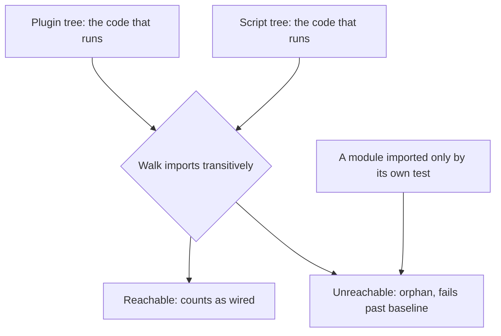

# A module can pass every check and still run nowhere

<em>We added a small set of guards to one project's quality gate in under two weeks, taking it from fewer than twenty steps to more than twenty. Two caught real defects the day they landed. The newest has caught nothing yet, and the gate still has blind spots we can name.</em>

> [!IMPORTANT]
> **The short version**
>
> - A module can pass every check while nothing in production runs it. "We built it" and "it runs" are different facts.
> - We added a small set of guards in under two weeks, taking the gate from fewer than twenty steps to more than twenty.
> - Two caught real defects the day they landed: a batch of committed backup files, a directory named after a drive letter, stray runtime files, and hardcoded home-path placeholders.
> - The newest guard, for orphan modules, has caught no live regression yet. Its value so far is a recorded baseline and a suite of tests that fail on demand.
> - It still looks at one directory only, and one of our gates is not wired into CI at all.

<aside class="rp-meta">

**Status:** working paper; pending owner review 
**Evidence:** the continuous-integration workflow, its guard scripts, and their git history, checked shortly before publication; figures are deliberately rounded and not independently reproducible 
**Repository:** private. The figures below were read from that repository's history and its continuous-integration records; a reader cannot reproduce them, and that limit is why each figure is stated with its provenance rather than asserted.

</aside>

## 1. The problem

We build features faster than we connect them. A module can be finished, tested, and imported by nothing, while the gate stays green. Every check we had ran on code that something already loaded. The linter lints what it reads. The test runner tests what it imports. Neither one asks whether the code runs.

So "we built it" and "it runs" became two separate facts. Only a person reading the tree could tell them apart, and reading the tree by hand is the work a gate exists to remove. A handful of finished modules sat in that state while their owning issue stayed open.

The same gap covered four other defect classes. Nothing checked whether a tracked file sat outside our canonical folder tree. Nothing caught a hardcoded machine path in a file that CI never ran. Nothing compared the code on the main branch against the engine the deployment actually loads. Nothing caught a helper that had been deleted while a call to it survived.

## 2. What changed

We took the gate from fewer than twenty steps to more than twenty in under two weeks. Most of the guards are new code. The hardcoded-path check is older: its test file predates this work by months, but no CI step ran it until the guard was wired in, so a machine path could merge back in without anyone noticing.

| Defect class | Checked before | Guard that checks it now |
|---|---|---|
| A module nothing runs | no | orphan-module guard |
| A tracked file outside the canonical tree | no | folder-structure guard |
| A hardcoded machine path | no | hardcoded-path guard |
| Main drifting from the live engine | no | engine-drift guard |
| A deleted helper still called at runtime | no | engine-undefined-name guard |

All five landed inside the same short window, which is why the gate's step count jumped in one stretch rather than drifting up over months.

Two older guards, for personal data and for the component registry, predate this window. They matter here because they show what a mature guard looks like once it has caught something.

## 3. How the orphan guard works

The unwired-module guard is the one we care about most. It answers a single question for each module under the source tree: can production reach it? Reachability is transitive from two roots, every file under the plugin tree and every file under the script tree, because those are the trees that actually run.

A test import does not count. A module imported only by its own test is still dead in production, and that is the exact defect the guard exists to find. This choice is deliberate, and it is the guard's sharpest edge.

The guard holds the gap at a declared baseline, a committed JSON file listing every module known to be unwired. It fails on a new orphan and warns when a baselined module becomes imported. The file started with a few dozen entries. Wiring a handful of attachment modules shrank it, and the guard reported each one as now-reachable so we could prune the record.

## 4. What the guards caught

Two guards caught real defects the day they landed. The hardcoded-path guard found hardcoded home-path placeholders in test files, and they were fixed in the same commit that added the step. The folder-structure guard found a batch of tracked backup files, a committed directory named after a drive letter, and stray untracked runtime files, all in the production checkout rather than in CI.

An older guard earned its keep too. The personal-data guard failed repeatedly during an earlier run and forced a fix before merge.

The orphan guard has caught nothing yet. It has run on one issue branch and on the main branch, and no new orphan has appeared since it landed. We are not going to dress that up. Its demonstrated value so far is the baseline itself, the prune that followed the wiring work, and a suite of tests that fail on demand when we plant an orphan in the source tree. A guard earns trust by catching something, and this one has not had the chance.

The engine guards are in the same position. They were built from a manual audit, not from a red run. They pin a known gap so it cannot widen.

## 5. Where it is still not enough

The orphan guard scans the source tree and nothing else. Its roots are the plugin tree and the script tree, but its candidates are only files under the source tree. A module under the plugin tree or under the skills tree that nothing imports is invisible to it. We have further modules under the plugin tree and the skills tree sitting in that blind spot.

The baseline is hand-maintained, and the guard has a flag that prints a fresh baseline and exits clean. Redirecting that output over the committed file would swallow every current orphan in one command. The docstring says the file shrinks by hand, but nothing enforces that except review.

Our adopter-content gate is not wired into CI at all. It checks that human-facing prose stays compliant, and it runs only when a person remembers to run it, so it gates nothing.

One more thing is worth recording, and it is the least specific to us. On the GitHub side, most failed pull-request-event quality runs had zero jobs. They never started. The runs that actually gate a branch are the push runs, and those are green. Anyone scanning the Actions list for red will see noise that is not a failing check. This one is about how the platform reports a run, not about our code, so it travels: if you read your own Actions list for red, count the jobs before you trust the colour.

## 6. What we would do next

Three changes would close most of the remaining gap. Point the orphan guard at the plugin and skills trees as well as the source tree. Add a CI step that fails when the baseline grows instead of shrinking. Wire the adopter-content gate into the same workflow that runs everything else.

None of those is hard. Each one removes a way for a defect to merge unseen, which is the only reason the gate exists.

## Related work in this series

- [db-r-2026-009 - The development cycle of an agent-built system](/research/papers/db-r-2026-009)
- [db-r-2026-008 - Verification independence without opinion aggregation](/research/papers/db-r-2026-008)
- [db-r-2026-004 - Black-box and grey-box validation](/research/papers/db-r-2026-004)

---

Cite as: Pujan (2026). *A module can pass every check and still run nowhere*. Design Bakery Research db-r-2026-011 (pending owner approval).
